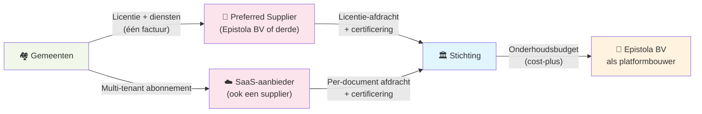

import FinancieleSimulatie from '../../../components/FinancieleSimulatie.astro';

Hoe ontwikkelt een stichting+BV-combinatie zoals Epistola zich financieel over de eerste vijf jaar? Veel hangt af van adoptietempo, gemiddelde gemeentegrootte en personeelsgroei. Onderstaande simulatie laat je aan de aannames schuiven.

---

## De geldstroom

> De stichting is effectief een vehicle om onderhoud op Epistola te financieren. Ze ontvangt licentie- en afdrachtinkomsten, betaalt daarmee het ontwikkel- en onderhoudswerk (uitbesteed, primair aan Epistola BV), houdt admin laag, en wat overblijft gaat naar reserve en investeringen die het ecosysteem versterken.

Gemeenten betalen niet rechtstreeks aan de stichting. Ze contracteren met een **preferred supplier** — een gecertificeerde leverancier die licentie, hosting en diensten in één offerte aanbiedt. **Epistola BV is zelf één van die preferred suppliers**, naast eventueel derde partijen.

De supplier doet drie dingen tegelijk:

1. **Levert diensten** aan de gemeente (hosting, support, training, consultancy) — hier zit zijn omzet
2. **Belast de licentie door** naar de gemeente, met een maximale marge erbovenop — die marge blijft bij de supplier
3. **Draagt de licentie-afdracht en de jaarlijkse certificeringsbijdrage af** aan de stichting

De stichting heeft zelf geen personeel. Voor het ontwikkel- en onderhoudswerk besteedt ze uit aan één of meer leveranciers — onder cost-plus pricing. Epistola BV is dan de meest voor de hand liggende partij vanwege diepe platformkennis, maar de stichting kan dat werk ook (deels) bij andere preferred suppliers beleggen. Voor de BV is platform-onderhoud daarmee één inkomstenbron naast haar dienstverlening aan gemeenten, geen vanzelfsprekendheid.

Ook de BV werkt cost-plus. Dat betekent: BV's totale jaaromzet (uit onderhoud + externe dienstverlening) ≈ BV's totale jaarkosten. Hoe meer de BV zelf uit gemeenten ophaalt, hoe minder de stichting hoeft bij te dragen aan het onderhoudsbudget. De simulator rekent zo: stichting-onderhoud = BV-totalskosten − BV-externe omzet.

De simulatie hieronder gaat er voor de eenvoud van uit dat al het platform-onderhoud door de BV wordt gedaan. In de praktijk kan het werk verdeeld worden; de totale stichting-uitgave blijft hetzelfde, alleen de BV-inkomsten verschuiven dan deels naar andere leveranciers.

De simulatie modelleert de stichting en de BV als aparte cash-flows. De BV is structureel break-even (cost-plus). De interessante dynamiek zit aan de stichting-kant: dekken de afdrachten vanuit de suppliers het BV-onderhoudsbudget plus de admin-overhead?

---

## Uitgangspunten

De berekening gebruikt:

- De [licentietabel uit Model 2](/epistola/model-2-bsl-licentie) als basis voor de licentie-inkomsten
- Schaalvoordeel-staffel (10+ gemeenten: −5%, 20+: −10%, 35+: −15%)
- Certificeringsbijdrage van €1.000 per preferred supplier per jaar
- SaaS-aanbieders dragen een vast bedrag per gegenereerd document af (slider in k€/jaar)
- BV-kosten = FTE × kosten per FTE × overhead-factor (default 1,30)
- Initiële investering om het tekort in jaar 1–2 op te vangen

De cijfers zijn projecties, geen voorspellingen. Ze laten zien hoe gevoelig de uitkomst is voor de aannames — niet wat er gebeurt.

---

<FinancieleSimulatie />

---

## Wat de simulatie wel en niet zegt

**Wel:**

- Bij welk adoptie-tempo het platform structureel zelfvoorzienend wordt
- Hoe groot de initiële investering moet zijn om jaar 1–2 te overbruggen
- Wanneer overwinst beschikbaar komt om terug te laten vloeien naar klanten, stichting en open source-bijdragen
- De drie inkomstenstromen voor de stichting: vaste licenties, SaaS per-document afdracht, certificeringsbijdragen
- De stichting→BV-stroom expliciet als onderhoudsbudget (cost-plus break-even voor de BV)

**Niet:**

- Eenmalige kosten zoals juridische oprichting, eerste certificeringsaudits of platform-bootstrap-werk
- Operationele risico's (uitval van een grote klant, security-incident, regulatoire wijzigingen)
- Het effect van de [aanbeveling aan de VNG](/epistola/modelkeuze#aanbeveling-aan-de-vng-pas-de-gibit-aan) — een GIBIT-onderhoudsbijdrage zou de inkomstenbasis aanzienlijk verbreden
- BV-omzet uit directe diensten aan gemeenten (de BV is ook preferred supplier; die omzet komt overeen met extra BV-kosten en is dus cost-plus break-even)
- Belasting, btw, terugbetalingsstromen aan investeerders (ROI-cap)

---

## Realistische scenario's

Een paar combinaties van aannames die het verkennen waard zijn:

- **Conservatief**: 3 gemeenten in jaar 1, +5 per jaar, Klein-bracket (≈€1.800), 2 FTE start + 2 per jaar, 1 preferred supplier
- **Baseline**: 5 gemeenten, +8 per jaar, Mid-bracket (€4.500), 2 FTE + 3 per jaar, 3 preferred suppliers
- **Optimistisch**: 10 gemeenten in jaar 1, +15 per jaar, Mid-bracket, 3 FTE + 4 per jaar, 5 preferred suppliers, €50k/jaar SaaS-afdracht

In elk scenario verschuift het break-even-moment, de benodigde investering en het moment waarop overwinst beschikbaar komt.

---

## Zie ook

- [Investeringen (referentie)](/referentie/investeringen) — De ROI-cap-structuur en investeringscategorieën
- [Voor Investeerders](/meedoen/investeerders/overzicht) — Hoe gemeenten zelf kunnen investeren
- [Model 2: BSL + Ecosysteem](/epistola/model-2-bsl-licentie) — De licentiebasis waar deze prognose op leunt
- [Epistola Organisatiestructuur](/epistola/organisatiestructuur) — De vijf constraints die de kostenstructuur bepalen
