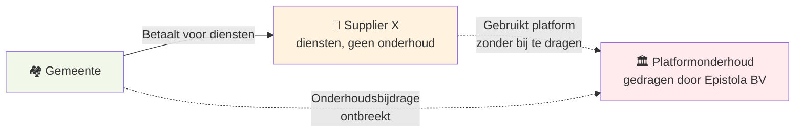

import ModelKader from '../../../components/ModelKader.astro';
import { Card, CardGrid, Aside } from '@astrojs/starlight/components';

<ModelKader model="1" />

In dit model is Epistola volledig open source: de code is vrij beschikbaar, zonder licentievereiste. De financiering komt uitsluitend uit diensten — expertise die de BV aanbiedt rondom het platform.

Dit is het model waar veel open source bedrijven mee beginnen. Het klinkt schoon: geen licentiedrempel, maximale adoptie, de waarde zit in de kennis niet in de code.

Of het houdbaar is, hangt volledig af van het antwoord op de kernvraag: *is de bijdrage aan het onderhoud extern geborgd?* Is er geen externe borging, dan manifesteert zich het structurele probleem dat hieronder wordt uitgewerkt. Is die borging er wél — bijvoorbeeld via de [aanbeveling aan de VNG](/epistola/modelkeuze#aanbeveling-aan-de-vng-pas-de-gibit-aan) — dan verdwijnt dat probleem en is dit model juist het schoonste antwoord.

---

## De diensten

In dit model verdient Epistola BV op:

- **Template kwaliteitscheck** — audit van bestaande documenten op toegankelijkheid, huisstijl en technische correctheid
- **Versie-compatibiliteitsvalidatie** — testen of bestaande templates werken na een platformupdate
- **Implementatie & migratie** — begeleiden van gemeenten bij onboarding en overstap
- **Training** — opleiden van functioneel beheerders, redacteuren en ICT-medewerkers
- **Maatwerk ontwikkeling** — specifieke integraties en uitbreidingen, code gaat upstream
- **Advies** — aanbestedingsondersteuning en architectuuradvies

Deze diensten zijn reëel waardevol. Gemeenten betalen er graag voor als de kwaliteit klopt. En in het begin — als Epistola de enige partij is die het platform door en door kent — is dit een houdbaar model.

---

## Het ecosysteem-incentive-conflict

Het probleem ontstaat als het platform succesvol wordt en andere partijen ook diensten willen aanbieden.

Dit is het spiegelbeeld van de geborgde geldstroom: de onderhoudsbijdrage die Model 1 *mét* borging wél kent, ontbreekt hier — en juist dat pad houdt het platform overeind.

Stel: Supplier X wil template kwaliteitschecks aanbieden aan gemeenten. Ze vragen Epistola BV om:
- Documentatie over de kwaliteitscriteria
- API-toegang tot de validatietooling
- Certificering als erkend template-auditor

**Wat is de rationele reactie van Epistola BV?**

Ze hebben geen belang bij goede antwoorden. Elke gemeente die haar template QA bij Supplier X afneemt, neemt die bij Epistola BV *niet* af. Goede documentatie, open APIs en derde-partij-certificering schaden direct de eigen omzet.

Dit is niet malicieus — het is structureel. Elk besluit dat het ecosysteem versterkt, schaadt de dienstenomzet van Epistola BV. En omdat de BV van die dienstenomzet moet leven, zijn dit ook de besluiten die intern worden uitgesteld, ondergeprioriteerd of afgewimpeld.

---

## Hoe dit in de praktijk uitpakt

### Gedrag op productniveau

Features die Epistola's eigen diensten ondersteunen, krijgen prioriteit. Features die derde partijen helpen, worden uitgesteld.

- Een zelfservice-onboarding tool die gemeenten zelf kunnen gebruiken? Verlaagt de vraag naar implementatiebegeleiding — geen prioriteit.
- Uitgebreide API-documentatie die derden kunnen gebruiken voor maatwerk? Maakt de maatwerk-dienst van Epistola minder exclusief — geen prioriteit.
- Een open template-validatiestandaard die iedereen kan implementeren? Maakt de template QA-dienst commoditair — geen prioriteit.

### Gedrag op ecosysteemniveau

Epistola BV heeft geen rationele prikkel om het ecosysteem van preferred suppliers te laten groeien — zeker niet in de diensten-ruimte die ze zelf bezet.

Certificering van concurrerende template-auditors? Wordt traag of nooit gedaan.

Uitnodiging aan derde partijen om te concurreren op implementatie? Wordt strategisch vermeden.

Open standaarden die derden in staat stellen te integreren? Blijven "op de roadmap" staan zonder concrete uitvoering.

### Wat er uiteindelijk gebeurt

<CardGrid>
  <Card title="Scenario A — het ecosysteem ontwikkelt zich niet" icon="warning">
    Epistola BV is de dominante of enige serieuze dienstverlener. Weinig concurrentie, weinig kwaliteitsprikkel, beperkte adoptie. Het platform blijft niche omdat er geen ecosysteem is dat het draagt.
  </Card>
  <Card title="Scenario B — het ecosysteem ontwikkelt zich ondanks Epistola" icon="warning">
    Andere partijen bieden diensten aan op de open code, zonder Epistola's hulp. Ze onderbieden Epistola op prijs — ze dragen immers geen onderhoudslast. De dienstenomzet daalt, de platformfinanciering komt onder druk, het model wordt onhoudbaar.
  </Card>
</CardGrid>

In beide scenario's faalt het model op de langere termijn.

---

## Waarom dit patroon zo vaak voorkomt

Dit is geen Epistola-specifiek risico. Het is het standaardpatroon van open source bedrijven die op diensten draaien.

HashiCorp bouwde Terraform als open source tool, verdienend op trainingen en enterprise features. Toen AWS Terraform-diensten begon aan te bieden zonder bij te dragen, reageerde HashiCorp met een restrictievere licentie (BSL). Het ecosysteem forkte: OpenTofu werd onder de Linux Foundation gebracht op basis van de laatste Apache 2.0-versie.

Elastic bouwde een bloeiend open source ecosysteem rondom Elasticsearch — totdat AWS dat ecosysteem exploiteerde via managed services. Elastic scherpte de licentie aan. Het ecosysteem werd kleiner en minder vertrouwen.

In elk geval: het dienstenmodel werkte zolang er geen groot ecosysteem was dat kon meeliftend. Zodra het platform succesvol genoeg werd om aantrekkelijk te zijn voor anderen, klapte het model in.

---

## Wanneer werkt Model 1 wél?

De problemen hierboven hebben twee wortels. De eerste: een derde partij kan diensten leveren op het platform zónder bij te dragen aan het onderhoud. De tweede: de partij die het platform bouwt en de standaarden zet, verdient zelf aan diensten — en heeft er dus belang bij het ecosysteem níet te makkelijk te maken. Model 1 is pas houdbaar als allebei zijn weggenomen:

- **Externe borging van de bijdrage.** Als elke gemeente die het platform gebruikt verplicht een onderhoudsbijdrage betaalt (ongeacht leverancier), kan niemand nog gratis meeliften. Dit is precies wat de [aanbeveling aan de VNG](/epistola/modelkeuze#aanbeveling-aan-de-vng-pas-de-gibit-aan) — optie 1 — regelt. Dit dicht de eerste wortel: de financiering.
- **Eigenaarschap los van de dienstenomzet.** Het platform, het IP en de governance horen in een stichting of steward-owned structuur, gescheiden van de partij die op diensten concurreert. Anders blijft de prikkel bestaan om certificering te vertragen of API's en documentatie mager te houden — ook als de financiering geborgd is. Dit dicht de tweede wortel: de controle. Zie [Organisatiestructuur](/epistola/organisatiestructuur) voor de stichting-BV-splitsing die dit borgt.
- Of, zonder dit alles, in beperkte vorm: zolang het platform zo gespecialiseerd is dat derden de expertise niet kunnen opbouwen, of de BV bewust klein blijft en geen ecosysteem nastreeft — beide tijdelijk en begrensd.

<Aside type="tip" title="Borging én eigenaarschap">
Model 1 werkt niet door het model zelf, maar door twee structurele waarborgen samen: de bijdrage is extern geborgd (niemand lift gratis mee) **én** het platform is in steward-owned/stichting-eigendom (de partij die de standaarden zet, verliest niets aan een gezond ecosysteem).
</Aside>

Dat is de generieke regel — en voor Epistola is daarvan al één van de twee voorwaarden vervuld. De eigenaarschapskant is geborgd via de [stichting-BV-structuur](/epistola/organisatiestructuur): platform, IP en governance zitten in de stichting, gescheiden van de BV die op diensten concurreert. Daardoor resteert nog maar één voorwaarde: de externe borging van de bijdrage. Voor Epistola — met de ambitie om alle 300+ Nederlandse gemeenten te bedienen en een gezond ecosysteem van leveranciers te bouwen — is Model 1 **zonder** die borging structureel ongeschikt; niet omdat het onethisch is, maar omdat de incentives dan verkeerd liggen. **Mét** die borging is Model 1 juist een uitstekend antwoord. Zie [de kernvraag](/epistola/modelkeuze) voor hoe dit zich verhoudt tot Model 2.

---

## GIBIT-compatibiliteit

**Volledig compatibel.** De software is een OSI-erkende open source licentie; standaard GIBIT-clausules over open source software en data-portabiliteit zijn direct toepasbaar. Geen aanpassingen aan de aanbestedingstekst nodig.

[→ Volledige analyse per clausule](/meedoen/gemeenten/gibit-compatibiliteit#model-1--volledig-open-source--diensten)

---

## Zie ook

- [De kernvraag](/epistola/modelkeuze) — Eén vraag, twee antwoorden: waar dit model in past
- [Model 2: BSL + Ecosysteem](/epistola/model-2-bsl-licentie) — Het andere antwoord: de licentie borgt zelf
- [Organisatiestructuur](/epistola/organisatiestructuur) — De BV-stichting structuur die beide antwoorden onderbouwt
- [Financieringsmodellen](/open-source/financieringsmodellen) — De brede afweging tussen community, licenties en subsidies
