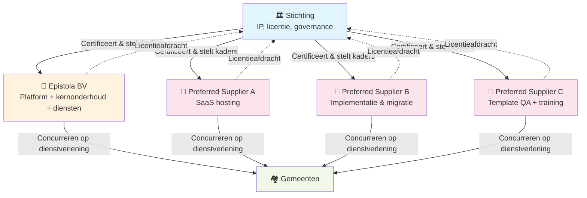

import LicentieTarieven from '../../../components/LicentieTarieven.astro';

Model 1 liet zien dat een diensten-only model structureel het verkeerde gedrag beloont: Epistola BV heeft geen reden om een ecosysteem te bouwen omdat elk nieuw ecosysteem-lid haar omzet bedreigt.

Model 2 lost dat op door de inkomstenstroom te splitsen. De stichting verdient op licenties. De BV verdient op diensten — maar nu als één van meerdere leveranciers in een open markt.

---

## Hoe het incentive-conflict verdwijnt

In Model 1 schaadde ecosysteemgroei de omzet van Epistola BV direct. In Model 2 is dat omgekeerd.

**Elke nieuwe preferred supplier die zich aansluit:**
- Betaalt licentieafdracht aan de stichting
- Brengt diensten naar gemeenten die Epistola BV niet kan bedienen (max 20 FTE)
- Trekt nieuwe gemeenten aan die anders het platform niet hadden gekozen
- Genereert meer licentie-inkomsten voor de stichting → beter gefinancierd platform → betere BV-omgeving

Epistola BV heeft nu een **positief belang** bij ecosysteemgroei. Meer suppliers = meer gemeenten = meer licenties = beter platform voor iedereen, inclusief de BV.

De besluiten die in Model 1 werden vermeden, worden in Model 2 vanzelfsprekend:
- Goede API-documentatie → meer derde partijen kunnen integreren → meer adoptie → meer licenties
- Derde-partij-certificering → groter ecosysteem → meer gemeenten → meer licenties
- Zelfservice-onboarding → lagere drempel voor adoptie → meer licenties
- Open template-standaard → meer ecosysteem-deelnemers → meer licenties

---

## Het marktecosysteem

Epistola BV is **first among equals**: de partij die het platform bouwt en de standaarden zet, maar niet de exclusieve dienstverlener. Andere preferred suppliers concurreren op kwaliteit, prijs en specialisatie.

Een gemeente die ontevreden is over haar preferred supplier, kiest een andere — zonder het platform te verlaten. Een preferred supplier die slechte kwaliteit levert, verliest klanten. Marktwerking op het dienstenniveau, stabiel eigenaarschap op het platform-niveau.

---

## De twee inkomstenbronnen voor de stichting

### Zelf-hosten: vaste licentie op inwonertal

Gemeenten die het platform op eigen infrastructuur draaien — of laten draaien door een preferred supplier — betalen een jaarlijkse licentie gebaseerd op hun inwonertal.

<LicentieTarieven />

Licenties worden niet rechtstreeks door gemeenten betaald — de preferred supplier draagt de licentiebijdrage af aan de stichting en belast dit door.

**Schaalvoordelen:** naarmate meer gemeenten deelnemen, dalen de tarieven (−5% bij 10+, −10% bij 20+, −15% bij 35+ gemeenten). Groei van het platform wordt direct doorgegeven aan de klanten.

### SaaS-hosting: gebruik-gebaseerde afdracht

Wanneer een preferred supplier het platform als multi-tenant cloud-dienst aanbiedt aan meerdere klanten tegelijk, is een vaste licentie per gemeente onpraktisch. In dat geval geldt een gebruik-gebaseerde afdracht: een klein bedrag per gegenereerd document.

Dit maakt SaaS-hosting eerlijk schaalbaar: wie meer gebruikt, draagt meer bij. De afdracht is zo gekalibreerd dat ze bij gemiddeld gebruik vergelijkbaar uitkomt met de vaste licentie.

Meerdere partijen kunnen SaaS aanbieden. Er is geen exclusiviteit.

---

## Diensten: de vrije markt

Naast de licentie-inkomsten voor de stichting bestaat er een open markt voor diensten. Elke preferred supplier kan diensten aanbieden; ze concurreren op kwaliteit en prijs.

| Dienst | Wie biedt het aan? | Prijsstelling |
|---|---|---|
| Template kwaliteitscheck | Epistola BV + preferred suppliers | Vrije markt |
| Versie-compatibiliteitsvalidatie | Epistola BV + preferred suppliers | Vrije markt |
| Implementatie & migratie | Epistola BV + preferred suppliers | Vrije markt |
| SaaS hosting | Preferred suppliers (niet Epistola BV) | Vrije markt + per-document afdracht |
| SLA & support | Preferred suppliers | Vrije markt |
| Training | Epistola BV + preferred suppliers | Vrije markt |
| Maatwerk | Epistola BV + preferred suppliers | Vrije markt; code gaat upstream |

Epistola BV kan diensten aanbieden als elke andere preferred supplier. Ze hebben geen voorkeursbehandeling. Hun voordeel is diepgaande platformkennis — niet exclusiviteit.

---

## De BSL: houvast zonder permanente lock-in

De Business Source License reguleert commercieel gebruik in jaar 1 na een release. Na precies één jaar gaat de code automatisch over naar Apache 2.0 — volledig vrij voor iedereen.

Dit heeft drie consequenties voor het ecosysteem:

**Voor gemeenten:** de maximale lock-in is één jaar. Wie een meerjarig contract sluit, zit het grootste deel van die periode al in het Apache 2.0-tijdperk van de vorige versie. Een concurrerende supplier kan altijd starten op basis van de vrijgegeven code.

**Voor preferred suppliers:** ze weten dat ze op een stabiel platform bouwen. De spelregels veranderen niet unilateraal. En ze kunnen zelf bijdragen aan de codebase, want de code is inzichtelijk.

**Voor de stichting:** de licentie financiert het beheer van het platform gedurende het jaar dat de code nog BSL is. De change date is statutair geborgd — de stichting kan dat niet terugdraaien zonder verzwaarde besluitvorming inclusief steward-instemmingsrecht.

**Voor andere organisaties:** niet-commercieel gebruik is volledig gratis. Commerciële organisaties kunnen het platform zonder licentie inzetten tot **200 documenten per dag** in productie; daarboven is een licentie nodig. Test- en acceptatieomgevingen zijn altijd onbeperkt vrij.

[→ Uitgebreide technische uitleg van de BSL en de gratis gebruiksruimte](/referentie/bsl-licentie#de-additional-use-grant-gratis-gebruiksruimte)

---

## Waarom Model 2 schaalbaar is

In Model 1 groeit de bottleneck mee met het succes: hoe meer gemeenten, hoe meer diensten nodig zijn, hoe meer Epistola BV moet groeien. Maar de BV is begrensd op 20 FTE.

In Model 2 groeit het ecosysteem mee zonder dat de BV groeit. Elke nieuwe preferred supplier voegt capaciteit toe. De stichting groeit mee in middelen (meer licenties) maar niet noodzakelijk in personeel. De BV blijft gefocust op wat alleen zij kan doen: de kern van het platform bouwen en onderhouden.

Het model is expliciet ontworpen voor schaal. Niet door de BV te laten groeien, maar door het ecosysteem te laten groeien.

---

## GIBIT-compatibiliteit

**Compatibel met expliciete toelichting.** De BSL is geen OSI-erkende open source licentie tijdens de eerste 12 maanden (na de change date wel: Apache 2.0). Gemeenten die in hun aanbesteding alleen OSI-erkende licenties accepteren, moeten die formulering verruimen naar "open source of source-available met geborgde overgang naar open source binnen 12 maanden". Geen blokker, wel een gespreksonderwerp voor de gemeente-jurist.

[→ Volledige analyse per clausule + aanbevolen aanbestedingsformuleringen](/meedoen/gemeenten/gibit-compatibiliteit#model-2--bsl--ecosysteem)

---

## Zie ook

- [Model 1: Open Source + Diensten](/epistola/model-1-open-source) — Waarom diensten-only niet werkt op schaal
- [Organisatiestructuur](/epistola/organisatiestructuur) — De BV-stichting structuur die dit model draagt
- [BSL Licentie (referentie)](/referentie/bsl-licentie) — Technische en juridische werking van de BSL
- [Afnemersperspectief](/open-source/afnemersperspectief) — Hoe gemeenten en leveranciers dit model beoordelen
