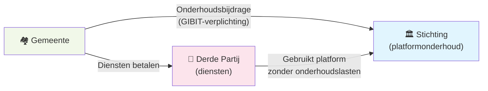

De vorige pagina's beschreven twee modellen elk op hun eigen merites. Deze pagina legt uit waarom we een voorkeur hebben, waarom de werkelijkheid van 2025 ons dwingt anders te beginnen, en hoe we hopen dat dat verandert.

---

## De vergelijking in één tabel

| | Model 1: Open Source + Diensten | Model 2: BSL + Ecosysteem |
|---|---|---|
| **Adoptiedrempel** | Geen — iedereen kan starten | Licentieverplichting vraagt uitleg |
| **Inkomstenstabiliteit** | Afhankelijk van dienstenvraag | Voorspelbaar via licenties |
| **Ecosysteem-incentive** | Negatief — elke concurrent schaadt omzet | Positief — elke supplier vergroot de markt |
| **Concurrentie op diensten** | Structureel nadeel (anderen liften mee) | Eerlijk speelveld via licentieplicht |
| **Schalbaarheid** | Begrensd door BV-capaciteit | Onbegrensd via ecosysteem |
| **Vertrouwen bij overheden** | Hoog ("echt open source") | Vraagt uitleg |
| **Financiering platform** | Kwetsbaar bij dienstenconcurrentie | Geborgd via stichting |

---

## Waarom we Model 2 prefereren

Model 2 lost het fundamentele probleem van Model 1 op: het ecosysteem-incentive-conflict. In Model 1 schaadt elke nieuwe dienstverlener onze eigen omzet. In Model 2 helpt elke nieuwe preferred supplier ons: meer suppliers = meer gemeenten = meer licenties = beter gefinancierd platform.

Dat is niet alleen beter voor Epistola — het is beter voor gemeenten. Een platform met meerdere concurrerende leveranciers is betrouwbaarder, goedkoper en beter bestand tegen het wegvallen van één partij.

Model 2 is ook het model dat we altijd al voor ogen hadden: een stichting die het IP beheert, een ecosysteem van suppliers dat concurreert op kwaliteit, en een BV die de kern bouwt zonder alles zelf te hoeven bedienen.

---

## Waarom we voorlopig met Model 1 beginnen

We leven niet in een ideale wereld.

Een groot deel van de Nederlandse gemeenten begrijpt niet dat open source ≠ gratis in stand te houden. De reactie op een licentieverzoek is te vaak: "maar het is toch open source?" — ook als diezelfde gemeente €300.000 uitgeeft aan een propriëtaire alternatief.

In die omgeving is een licentiemodel aan de voorkant een adoptierem. Als gemeenten al moeite hebben met het concept van "betalen voor iets dat je ook gratis kunt downloaden", is het gesprek over de BSL en de change date nog een stap verder.

We kiezen er daarom voor om te beginnen met Model 1: volledig open source, verdienen op diensten. Dat maakt onboarding eenvoudiger, verlaagt de drempel voor gemeenten die voorzichtig zijn, en geeft ons de kans om het platform te bewijzen voordat we het gesprek over financiering op platformniveau voeren.

We zijn ons bewust van het risico. Model 1 is houdbaar zolang we de dominante dienstverlener zijn. Zodra anderen onze services onderbieden zonder bij te dragen aan het onderhoud, verslechtert onze positie. Dat is de toestand die we willen voorkomen — en waarop de aanbeveling aan de VNG is gericht.

---

## Aanbeveling aan de VNG: pas de GIBIT aan

De **GIBIT** (Gemeentelijke Inkoopvoorwaarden bij IT) is de standaard set inkoopvoorwaarden die Nederlandse gemeenten gebruiken bij IT-aanbestedingen. Ze worden beheerd door de **VNG** (Vereniging van Nederlandse Gemeenten).

Wij adviseren de VNG om de GIBIT-voorwaarden zo aan te passen dat afnemers van open source software verplicht zijn om bij te dragen aan de continuïteit van het platform — ten minste in de vorm van een onderhoudsbijdrage.

### De kern van de aanbeveling

> **Als een gemeente open source software gebruikt én diensten afneemt van een andere partij dan de oorspronkelijke ontwikkelaar, is zij verplicht een onderhoudsbijdrage te betalen aan de organisatie die het platform beheert.**

### Waarom dit logisch is

Wanneer een gemeente diensten afneemt van een derde partij in plaats van de oorspronkelijke ontwikkelaar, profiteert die derde partij van het platform zonder bij te dragen aan het onderhoud. De oorspronkelijke ontwikkelaar draagt de onderhoudslasten maar mist de dienstenomzet.

Het resultaat: de financiering van het platform erodeert naarmate het platform succesvoller wordt. Dat is exact het free-rider probleem dat open source platformsoftware structureel bedreigt.

Een GIBIT-verplichting tot onderhoudsbijdrage lost dit op:

- De gemeente betaalt een kleine bijdrage aan de stichting of het platform-onderhoudsfonds — ongeacht welke leverancier ze kiest voor diensten
- De derde-partij-leverancier kan concurreren op diensten, maar draagt via de gemeente bij aan het platformonderhoud
- De oorspronkelijke ontwikkelaar kan investeren in het platform zonder volledig afhankelijk te zijn van dienstenomzet

### Het effect op Model 1

Met een GIBIT-onderhoudsbijdrage wordt Model 1 structureel houdbaarder:

- Derde partijen kunnen concurreren op diensten — dat is goed, het bevordert kwaliteit
- Maar ze kunnen niet meer volledig gratis meeliften op het platform — de gemeente betaalt altijd een bijdrage aan het onderhoud
- De hoogte van die bijdrage kan aansluiten bij de schaal van de gemeente (vergelijkbaar met de licentietabel in Model 2)

In essentie introduceert een GIBIT-verplichting een geformaliseerde continuïteitsbijdrage — de brug tussen Model 1 en Model 2.

### Het effect op adoptie

Een GIBIT-verplichting verlaagt de adoptiedrempel voor open source software in de publieke sector. Gemeenten hoeven niet langer individueel de discussie te voeren over "moet ik bijdragen aan dit platform?" — de verplichting staat in de standaardvoorwaarden die ze toch al hanteren.

Voor gemeenten die al gewend zijn aan de GIBIT, is een onderhoudsbijdrage voor open source software geen nieuwe drempel maar een vertrouwd contractueel element.

---

## De transitie

We verwachten dat de situatie evolueert:

**Nu (Model 1):** Volledig open source, verdienen op diensten. We bouwen het platform, bewijzen de waarde, en verzamelen goodwill bij gemeenten.

**Overgang:** Als het gesprek over platformfinanciering rijp is — ofwel door GIBIT-aanpassing ofwel door groeiende marktkennis bij gemeenten — introduceren we de licentiestructuur van Model 2.

**Later (Model 2):** BSL + ecosysteem. Stichting ontvangt licenties, preferred suppliers concurreren op diensten, ecosysteem groeit zonder incentive-conflict.

De organisatiestructuur (stichting + BV, de afspraken over salaris en focus) is al ingericht voor Model 2. Het licentiemodel kan worden geactiveerd zodra de markt er klaar voor is.

---

## Zie ook

- [Model 1: Open Source + Diensten](/epistola/model-1-open-source) — De volledige uitwerking van het diensten-model
- [Model 2: BSL + Ecosysteem](/epistola/model-2-bsl-licentie) — De volledige uitwerking van het licentie-ecosysteemmodel
- [Organisatiestructuur](/epistola/organisatiestructuur) — De BV en stichting die beide modellen onderbouwen
- [Financieringsmodellen](/open-source/financieringsmodellen) — De bredere afweging tussen community, licenties en subsidies
