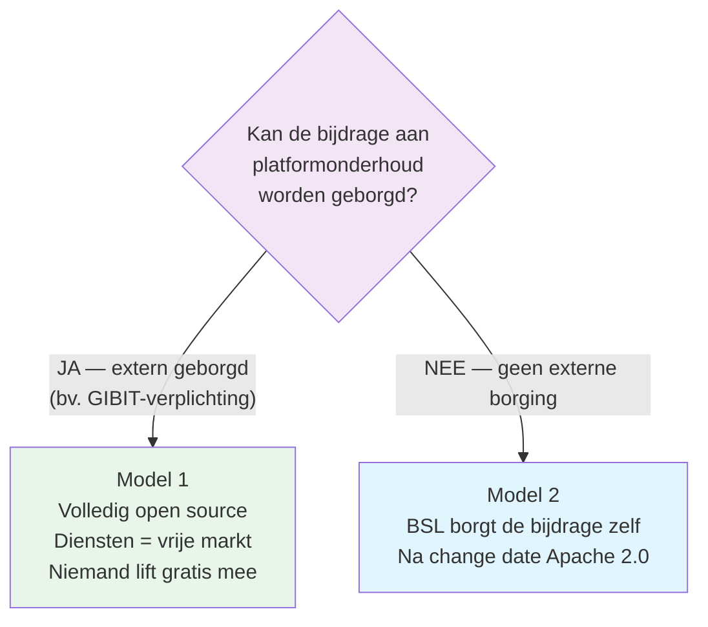
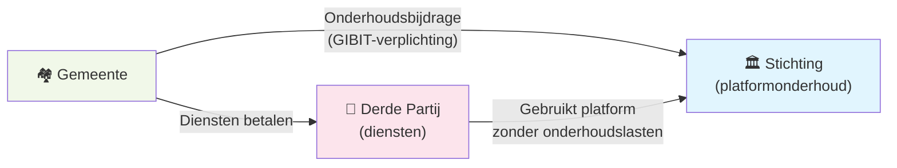

import { Card, CardGrid, Aside, Steps } from '@astrojs/starlight/components';

Open source óf BSL, diensten óf licenties — het lijkt een keuze tussen modellen, elk met eigen voor- en nadelen. Dat is het verkeerde debat.

Er is maar één vraag die er werkelijk toe doet:

> **Kan de bijdrage aan het onderhoud van het platform worden geborgd?**

Model 1 en Model 2 zijn geen rivalen. Het zijn twee antwoorden op deze ene vraag. Welk antwoord juist is, hangt niet af van een ideologische voorkeur, maar van één feitelijke omstandigheid: bestaat er een mechanisme dat de bijdrage afdwingt, of niet?

---

## De kernvraag

Het free-rider-probleem — wie diensten levert op andermans platform zonder bij te dragen aan het onderhoud — is de bedreiging. De vraag is alleen: *wat* houdt free-riding tegen?

- Wordt het tegengehouden door iets **buiten** de software (een afspraak, een inkoopvoorwaarde, een wettelijke verplichting)? Dan heb je geen licentierem nodig. **Model 1 werkt.**
- Is er **niets** buiten de software dat het tegenhoudt? Dan moet de software het zelf doen. **Model 2 is het antwoord:** de licentie wordt het borgingsmechanisme.

---

## Twee antwoorden op één vraag

<CardGrid>
  <Card title="Antwoord 1 — Model 1: borging buiten de licentie" icon="document">
    Is de bijdrage extern geborgd, dan vervalt de reden om de code te beperken. De concreetste vorm: een aanpassing van de GIBIT (zie hieronder) — elke gemeente die het platform gebruikt, betaalt een onderhoudsbijdrage, ongeacht van welke leverancier ze diensten afneemt.

    Het ecosysteem-incentive-conflict van Model 1 verdwijnt: derde partijen concurreren vrij op diensten, maar kunnen niet langer *gratis* meeliften. Volledig open source is dan niet alleen ethisch het schoonst, maar ook structureel houdbaar.

    [→ Model 1 in detail](/epistola/model-1-open-source)
  </Card>
  <Card title="Antwoord 2 — Model 2: borging in de licentie" icon="open-book">
    Is er geen externe borging, dan kan het platform niet leunen op de goodwill van afnemers — het borgingsmechanisme moet in de software zelf zitten. Dat doet de BSL: commercieel gebruik vereist tijdelijk een licentie, en na de change date wordt de code alsnog volledig open source (Apache 2.0).

    Elke nieuwe preferred supplier betaalt licentieafdracht aan de stichting en vergroot de markt. Het conflict verdwijnt niet door een externe afspraak, maar doordat de licentie de bijdrage zelf borgt.

    [→ Model 2 in detail](/epistola/model-2-bsl-licentie)
  </Card>
</CardGrid>

**Beide antwoorden lossen hetzelfde probleem op.** Het verschil zit niet in het doel (geborgde continuïteit, uiteindelijk open code) maar in *waar* de borging zit: in een externe afspraak, of in de licentie.

---

## Waar Epistola vandaag staat

Vandaag bestaat er **geen** externe borging. De GIBIT verplicht gemeenten niet om bij te dragen aan platformonderhoud. Het antwoord op de kernvraag is op dit moment dus: *nee, de bijdrage is niet extern geborgd.*

Toch draait Epistola nu Model 1 — volledig open source, verdienen op diensten. Niet omdat we de kernvraag negeren, maar omdat een licentiemodel aan de voorkant vandaag een adoptierem is: een groot deel van de Nederlandse gemeenten begrijpt nog niet dat open source ≠ gratis in stand te houden. De reactie op een licentieverzoek is te vaak "maar het is toch open source?" — ook als diezelfde gemeente €300.000 uitgeeft aan een propriëtair alternatief.

<Aside type="caution" title="Een expliciet tijdelijke keuze">
Model 1 *zonder* geborgde bijdrage is houdbaar zolang Epistola de dominante dienstverlener is, en niet langer. Zodra anderen onze diensten onderbieden zonder bij te dragen aan het onderhoud, verslechtert de positie. We draaien Model 1 dus wetend dat de borging nog ontbreekt — en we werken aan precies die borging.
</Aside>

Wat we bepleiten is daarom geen specifiek model. Het is **dat de borging gaat bestaan.** Zodra dat zo is, is de modelkeuze geen dilemma meer maar een afgeleide: borging extern geregeld → Model 1; niet → Model 2.

---

## De vergelijking in één tabel

De tabel hieronder leest het beste vanuit de kernvraag: de twee kolommen zijn de twee antwoorden.

| | Model 1: borging extern (bv. GIBIT) | Model 2: borging in de licentie |
|---|---|---|
| **Adoptiedrempel** | Geen — iedereen kan starten | Licentieverplichting vraagt uitleg |
| **Inkomstenstabiliteit** | Geborgd via de externe bijdrage | Voorspelbaar via licenties |
| **Ecosysteem-incentive** | Positief *mits* bijdrage geborgd | Positief — elke supplier vergroot de markt |
| **Concurrentie op diensten** | Eerlijk speelveld *mits* borging | Eerlijk speelveld via licentieplicht |
| **Schaalbaarheid** | Onbegrensd mits borging | Onbegrensd via ecosysteem |
| **Klantconcentratie** | Verspreid over gemeenten | Verspreid over gemeenten |
| **Innovatiesnelheid** | Hoog | Hoog |
| **Vertrouwen bij overheden** | Hoog ("echt open source") | Vraagt uitleg |
| **Borgingsmechanisme** | Externe afspraak (GIBIT) | De licentie zelf |
| **Lock-in risico** | Laag (open code) | Laag (BSL + Apache 2.0) |

Zonder externe borging vallen de Model 1-cellen met "*mits borging*" weg — dat is precies waarom Model 1 vandaag niet vanzelf houdbaar is, en waarom de aanbeveling aan de VNG ertoe doet.

---

## Aanbeveling aan de VNG: pas de GIBIT aan

De **GIBIT** (Gemeentelijke Inkoopvoorwaarden bij IT) is de standaard set inkoopvoorwaarden die Nederlandse gemeenten gebruiken bij IT-aanbestedingen. Ze worden beheerd door de **VNG** (Vereniging van Nederlandse Gemeenten).

De aanbeveling is in de kern simpel: **maak de borging die nu ontbreekt, mogelijk.** Dat kan op twee manieren — en die twee manieren zijn niet toevallig precies de twee antwoorden op de kernvraag:

1. **Verplichte redelijke bijdrage bij open source.** Neem in de GIBIT op dat een gemeente die open source software gebruikt, verplicht is een redelijke onderhoudsbijdrage te betalen aan de partij die het platform onderhoudt — ongeacht welke leverancier ze voor diensten kiest. *Dit creëert de externe borging en maakt daarmee **antwoord 1 (Model 1)** structureel houdbaar.*

2. **Erken een licentiecategorie: BSL+1jaar.** Voeg in de GIBIT een categorie toe voor source-available software met geborgde overgang naar Apache 2.0 binnen 12 maanden. *Dit maakt **antwoord 2 (Model 2)** expliciet aanbestedbaar, met de continuïteitsbescherming in de licentie zelf.*

Optie 1 borgt de bijdrage buiten de licentie; optie 2 erkent een licentie die de bijdrage zelf borgt. Het zijn dezelfde twee antwoorden, nu als beleidskeuze voor de VNG. Beide maken Epistola — en vergelijkbare publieke-sector open source platforms — structureel financierbaar.

### Waarom dit logisch is

Wanneer een gemeente diensten afneemt van een derde partij in plaats van de oorspronkelijke ontwikkelaar, profiteert die derde partij van het platform zonder bij te dragen aan het onderhoud. De oorspronkelijke ontwikkelaar draagt de onderhoudslasten maar mist de dienstenomzet.

Het resultaat: de financiering van het platform erodeert naarmate het platform succesvoller wordt. Dat is exact het free-rider-probleem dat open source platformsoftware structureel bedreigt — en de reden dat de kernvraag de kernvraag is.

Een GIBIT-verplichting tot onderhoudsbijdrage lost dit op:

- De gemeente betaalt een kleine bijdrage aan de stichting of het platform-onderhoudsfonds — ongeacht welke leverancier ze kiest voor diensten
- De derde-partij-leverancier kan concurreren op diensten, maar draagt via de gemeente bij aan het platformonderhoud
- De oorspronkelijke ontwikkelaar kan investeren in het platform zonder volledig afhankelijk te zijn van dienstenomzet

### Het effect op de modelkeuze

Met een GIBIT-onderhoudsbijdrage wordt antwoord 1 — Model 1 — structureel houdbaar:

- Derde partijen kunnen concurreren op diensten — dat is goed, het bevordert kwaliteit
- Maar ze kunnen niet meer volledig gratis meeliften op het platform — de gemeente betaalt altijd een bijdrage aan het onderhoud
- De hoogte van die bijdrage kan aansluiten bij de schaal van de gemeente (vergelijkbaar met de licentietabel in Model 2)

In essentie introduceert optie 1 een geformaliseerde continuïteitsbijdrage — dezelfde borging die Model 2 in de licentie stopt, maar dan in de inkoopvoorwaarden. Vandaar dat de twee opties twee kanten van dezelfde medaille zijn.

### Het effect op adoptie

Een GIBIT-verplichting verlaagt de adoptiedrempel voor open source software in de publieke sector. Gemeenten hoeven niet langer individueel de discussie te voeren over "moet ik bijdragen aan dit platform?" — de verplichting staat in de standaardvoorwaarden die ze toch al hanteren.

Voor gemeenten die al gewend zijn aan de GIBIT, is een onderhoudsbijdrage voor open source software geen nieuwe drempel maar een vertrouwd contractueel element.

---

## De transitie

De kernvraag verklaart ook waarom Epistola's positie over tijd verschuift — niet als een zwabberende voorkeur, maar als een afgeleide van of de borging bestaat:

<Steps>

1. **Nu — geen externe borging.** Epistola draait Model 1 *zonder geborgde bijdrage*, expliciet tijdelijk. We bouwen het platform, bewijzen de waarde, en werken aan de borging.

2. **Overgang — de borging ontstaat.** Ofwel door GIBIT-aanpassing (optie 1), ofwel doordat de markt de BSL-categorie accepteert (optie 2). Vanaf dat moment is de modelkeuze geen dilemma meer.

3. **Daarna — de keuze is een afgeleide.** Borging extern geregeld → Model 1 blijft, nu structureel houdbaar. Geen externe borging maar BSL geaccepteerd → Model 2, de licentie borgt zelf.

</Steps>

De organisatiestructuur (stichting + BV, de afspraken over salaris en focus) is bewust zo ingericht dat ze met beide antwoorden werkt. Wat nog ontbreekt is niet de structuur, maar de borging.

---

## Zie ook

- [Model 1: Open Source + Diensten](/epistola/model-1-open-source) — Antwoord 1: waarom het zonder borging vastloopt, en de twee voorwaarden waaronder het wél werkt
- [Model 2: BSL + Ecosysteem](/epistola/model-2-bsl-licentie) — Antwoord 2, borging in de licentie
- [Centrale aanbesteding](/epistola/model-3-centraal-aanbesteed) — De centrale-aanbestedingsvorm en het monopsonie-risico
- [Organisatiestructuur](/epistola/organisatiestructuur) — De BV en stichting die met beide antwoorden werken
- [Financieringsmodellen](/open-source/financieringsmodellen) — De bredere afweging tussen community, licenties en subsidies
