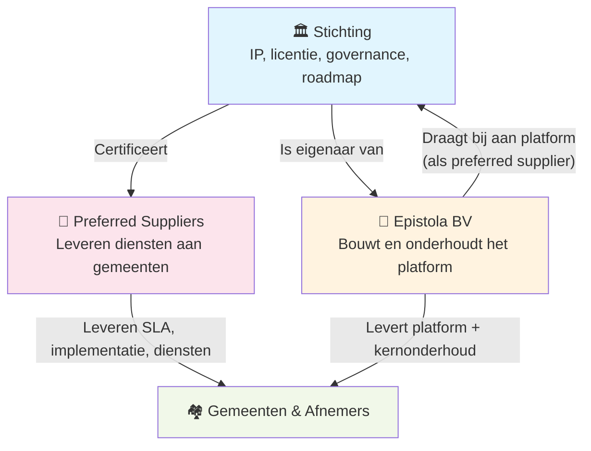

De voorgaande hoofdstukken beschreven hoe een open source platform structureel en financieel gezond kan zijn. Dit hoofdstuk gaat over hoe Epistola dat model concreet invult.

Het uitgangspunt: twee entiteiten. De **stichting** beheert het intellectueel eigendom en bewaakt de missie. De **BV** bouwt en onderhoudt het platform als operationele uitvoerder. De stichting is eigenaar van de BV — niet andersom, en niet een externe investeerder.

---

## De structuur



De stichting **controleert** de BV via eigenaarschap. De BV kan niet worden verkocht, overgenomen of van koers veranderd zonder instemming van de stichting. De stichting stelt de kaders — via statuten, aandeelhoudersovereenkomst en bestuurlijke afspraken.

De BV is zelf ook een preferred supplier: ze bouwt de kern van het platform en draagt code upstream bij. Andere preferred suppliers opereren naast de BV en concurreren op dienstverlening.

---

## Cost-plus pricing

De organisatiestructuur maakt cost-plus pricing mogelijk: prijzen worden niet bepaald door wat de markt maximaal wil betalen, maar door wat de organisatie kost om te draaien.

Dit werkt omdat de kostenstructuur expliciet begrensd is (zie hieronder). Als de totale kosten bekend en begrensd zijn, en het aantal klanten groeit, dalen de prijzen per klant — precies zoals het [cost-recovery model](/organisatiestructuur/cost-recovery) beschrijft.

---

## De afspraken

De kaders die de stichting stelt aan de BV zijn juridisch vastgelegd.

### Maximum salaris

De BV hanteert een intern salarisplafond. Niemand — inclusief de oprichters — verdient meer dan dit maximum. Het plafond is gekoppeld aan een marktconforme maatstaf en wordt periodiek geëvalueerd door de stichting.

**Waarom:** Het voorkomt dat de BV een vehikel wordt voor persoonlijke verrijking. Mensen die hier werken, doen dat omdat ze in de missie geloven.

**Effect:** Het maakt de maximale loonkosten berekenbaar.

### Geen winstuitkeringen

De BV keert geen winst uit aan aandeelhouders. De stichting is de aandeelhouder — en de stichting keert ook geen winst uit. Overwinst blijft in de organisatie of wordt teruggesluisd.

**Waarom:** Winstmaximalisatie als drijfveer strijdt fundamenteel met de missie. Zodra er druk is om winstmarge te verhogen, begint de missie te eroderen.

### Overwinst gaat terug

Als de BV structureel meer inkomsten heeft dan nodig voor haar operatie en reserves, gaat de overwinst niet naar aandeelhouders maar terug naar de gemeenschap:

- **Terug naar klanten** — via lagere tarieven of een eenmalige korting voor bestaande afnemers
- **Naar de stichting** — voor het ondersteunen van vergelijkbare steward-owned projecten in de publieke sector
- **Terug naar de open source-gemeenschap** — een vast aandeel gaat naar de open source projecten waar Epistola zelf op draait, met expliciete voorrang voor kleinere projecten en solo-maintainers boven de grote, al ruim gefinancierde projecten

**Waarom open source-bijdrage:** Epistola is gebouwd op een fundament van vrije software. Het is intellectueel oneerlijk om dat te negeren in een verhaal over duurzame financiering van open source. Door bewust te bijdragen — en bewust de kleine projecten te prioriteren waar de fragiliteit het grootst is — sluit het model de cirkel.

### 100% focus op Epistola

De BV mag uitsluitend Epistola bouwen. Geen aanverwante producten, geen winstgevende nevenaventures.

**Waarom:** Focus is een garantie, niet alleen een strategie. Als de BV mag uitbreiden naar andere producten, ontstaat er een prikkel om capaciteit van Epistola weg te halen naar kansen met een hogere marge.

### Maximum omvang: 20 FTE (Nederland)

Zolang de BV alleen in Nederland opereert, groeit ze niet boven 20 voltijdse medewerkers.

**Waarom:** Dit is de structurele begrenzing die cost-plus pricing werkbaar maakt — zie het kostenmodel hieronder. Als vraag en capaciteit groeien voorbij wat 20 FTE aankan, wordt extra capaciteit geborgd via het ecosysteem van preferred suppliers, niet via interne groei van de BV.

---

## Het kostenmodel

De combinatie van maximum salaris en maximum omvang maakt de maximale operationele kosten uitrekenbaar en publiek:

```
Maximale jaarkosten BV ≈ 20 FTE × maximum salaris × (1 + overhead factor)
```

De stichting weet dus wat het kost om de BV te laten functioneren. Dat maakt het bepalen van tarieven minder gokken en meer rekenwerk: hoeveel klanten moeten hoeveel betalen om de stichting en de BV duurzaam te financieren?

---

## Waarom deze combinatie werkt

| Afspraak | Voorkomt | Bevordert |
|---|---|---|
| Maximum salaris | Persoonlijke verrijking als drijfveer | Mission-gedreven medewerkers |
| Geen winstuitkering | Exit-druk, investeerdersbelang | Lange-termijn focus |
| Overwinst terug naar gemeenschap | Accumulatie in de BV | Vertrouwen bij afnemers |
| 100% focus | Capaciteitsafleiding, missie-erosie | Kwaliteit van het kernproduct |
| Max 20 FTE | Ongecontroleerde kostengroei | Voorspelbaarheid voor alle partijen |

Het model is niet perfect: groei is begrensd, salarisniveaus zijn begrensd. Maar dat is de bewuste keuze: een stabiele, missie-gestuurde organisatie die jarenlang kan functioneren, is meer waard dan een snelgroeiende organisatie die de missie onderweg verliest.

---

## Zie ook

- [Cost-Recovery Model](/organisatiestructuur/cost-recovery) — Het pricing-principe waarop dit gebaseerd is
- [Missiegedreven & Steward Ownership](/organisatiestructuur/steward-ownership) — De brede principes van eigendomsstructuur
- [Model 1: Open Source + Diensten](/epistola/model-1-open-source) — Wat er mis gaat als financiering alleen op diensten rust
- [Model 2: BSL + Ecosysteem](/epistola/model-2-bsl-licentie) — Hoe het licentiemodel een gezond ecosysteem mogelijk maakt
