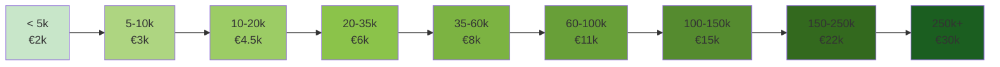

Dit document beschrijft het licentie- en kostenbeleid van Epistola.
Het legt vast hoe licentiekosten, schaal, begroting en besteding van
middelen zijn ingericht, in lijn met steward ownership en publieke waarden.

Het doel van dit beleid is om Epistola duurzaam te beheren als publieke digitale voorziening,
zonder winstmaximalisatie en zonder vendor lock-in.

---

## Kernprincipes

- **Licentiekosten financieren stichting-governance**, niet development
- **Preferred suppliers** doen alle development, SLA, hosting, custom features
- **Gemeentes betalen suppliers**, niet rechtstreeks de stichting
- Stichting heeft **geen winstoogmerk**
- **Schaalvoordelen** vloeien terug naar afnemers en het ecosysteem
- Stichting schaalt realistisch (niet vooruit op groei)

---

## Rollen en inkomsten

### Stichting Epistola

**Taken:**
- Governance, stewardship, architectuur-regie
- IP-beheer, licentie-handhaving
- Preferred supplier certificering & toezicht
- Roadmap-principes (wat mag, wat niet)

**Inkomsten:**
- Licentiekosten (doorbelast door preferred suppliers)
- Certificerings-fees (preferred suppliers)
- Optioneel: investeringen met gemaximeerd rendement

**Geen activiteiten:**
- Development/kernontwikkeling
- SLA/operatie
- Support/hosting
- Custom development

---

### Preferred Suppliers

**Taken:**
- SLA, onderhoud, hosting, support
- Implementaties, migraties, training
- **Doorontwikkeling & features** (onder architectuur-regie stichting)
- Custom development (betaald door gemeentes)

**Inkomsten:**
- SLA/lifecycle management (vrije marktprijs)
- Hosting/infrastructure (vrije marktprijs)
- Support/training (vrije marktprijs)
- Custom development (vrije marktprijs)
- Marge op doorbelasting licentiekosten (gemaximeerd)

---

## Licentieprijzen

### Model: Schaal gebaseerd op inwonertal

**Uitgangspunt:** Licentie volgt gemeentelijke schaal (inwoners), niet gebruikersaantal.
Aantal documenten/brieven speelt geen rol (onbeperkt).

| Gemeentegrootte | Inwoners | Licentie/jaar |
|---|---|---|
| Micro | < 5k | €2.000 |
| Zeer klein | 5–10k | €3.000 |
| Klein | 10–20k | €4.500 |
| Klein–mid | 20–35k | €6.000 |
| Mid | 35–60k | €8.000 |
| Mid–groot | 60–100k | €11.000 |
| Groot | 100–150k | €15.000 |
| Zeer groot | 150–250k | €22.000 |
| XL | 250k+ | €30.000 |

**Praktijkvoorbeelden:**
- Gemeente 5k inwoners: **€2.000/jaar**
- Gemeente 50k inwoners: **€8.000/jaar**
- Gemeente 100k inwoners: **€15.000/jaar**

### Prijsschaling Visualisatie



:::tip[Schaalvoordelen]
Grotere gemeenten betalen relatief **minder per inwoner**, waardoor Epistola toegankelijk blijft voor alle gemeentegrootten. Entry-barrier: ✅ Laag voor kleine gemeentes, ✅ realistisch voor grote
:::

---

## Vooruitbetaling en incentives

### Standaardmodel: 1-jarig contract met vooruitbetaling

Gemeentes betalen licentie **1 jaar vooruit** (standaard commercial practice voor SaaS).

**Voorbeeld:**
- Gemeente 50k inwoners tekent contract in januari
- Betaalt direct: €8.000 (licentie jaar 1)
- Januari volgende jaar: hernieuwing + betaling jaar 2

### Incentive: 3-jarig contract met 10% korting

**Voordeel stichting:** Langterm zekerheid (geld jaar 1–3 tegelijk)
**Voordeel gemeente:** Kostenbesparing + zekerheid

**Voorbeeld:**
- 3-jarig contract: €8.000/jaar × 3 = €24.000 → met 10% korting = **€21.600**
- Betaald in maand 1, dekking 3 jaar
- Schuldverlichting voor gemeentebegroting

---

## Wat dekken licentiekosten?

Licentiekosten (betaald aan stichting) financieren:

- **Governance & stewardship** – bestuur, stewards, audit
- **Architectuur-regie** – vastleggen standaarden, design principes
- **IP-beheer** – brandinstellinggen, licentiehandhaving, security-regie
- **Certificering preferred suppliers** – kwaliteit, security, compliance
- **Publieke roadmap-regie** – bepalen welke features collectief belangrijk zijn
- **Ondersteuning upstream-contributie** – zorgen dat custom dev/features terugkomen

Licentiekosten dekken **NIET**:
- SLA/operatie/monitoring (preferred supplier bepaalt)
- Hosting/infrastructure (preferred supplier bepaalt)
- Support/training (preferred supplier bepaalt)
- Custom development (betaald separate door gemeente)
- Gewone bug-fixes (upstream, deel van preferred supplier-verplichting)

---

## Custom development & features

### Wie betaalt doorontwikkeling?

**Collectief (roadmap):**
- Als 3+ gemeentes dezelfde feature willen → opnemen in publieke roadmap
- Gefinancierd via stichting-investering (licentiekosten)
- Preferred supplier voert uit, resultaat is upstream

**Individueel (custom):**
- Gemeente X wil specifieke integratie → private development
- Gemeente betaalt preferred supplier direct
- Preferred supplier voert uit (architectuur stichting respecteert)
- Code gaat upstream (geen private forks)

**Verdienmodel preferred supplier:**
```
Gemeente A: €8.000 licentie + €15.000 custom dev + €20.000 SLA/hosting = €43.000 totaal
Gemeente B: €8.000 licentie + €0 custom + €20.000 SLA/hosting = €28.000 totaal

Preferred supplier houdt: ~€90.000 combined (verdient aan custom dev & services, niet licentie)
Stichting ontvangt: €16.000 licentie-inkomsten
```

Dit is gezond verdienmodel voor beide.

---

## Gefaseerde groei stichting (realistisch)

Stichting doet GEEN development, dus budget is veel kleiner.

### Jaar 1: Validatiefase

| Item | Budget |
|---|---|
| Director/Governance (0.5 FTE) | €50.000 |
| Architect/Certificering contractor (part-time) | €15.000 |
| Overhead, juridisch, admin | €10.000 |
| **Totaal** | **€75.000** |

**Inkomsten:**
- 5 gemeentes × €5k avg = €25.000
- Certificering 2 suppliers × €3k = €6.000
- **Totaal: €31.000**

**Gap:** €44.000 → **investering nodig** (zie investeringsperspectief)

---

### Jaar 2: Groeifase

| Item | Budget |
|---|---|
| Director/Governance (0.75 FTE) | €60.000 |
| Architect/Security/Cert (0.5 FTE) | €40.000 |
| Overhead, legal, admin | €20.000 |
| **Totaal** | **€120.000** |

**Inkomsten:**
- 12 gemeentes × €7k avg = €84.000
- Certificering 6 suppliers × €2k = €12.000
- **Totaal: €96.000**

**Gap:** €24.000 → **investeringen terugbetaling start** of kleine buffer

---

### Jaar 3: Self-sustaining

| Item | Budget |
|---|---|
| Director/Governance (1 FTE) | €80.000 |
| Architect (0.5 FTE) + Security consultant | €60.000 |
| Overhead, legal, audit | €25.000 |
| **Totaal** | **€165.000** |

**Inkomsten:**
- 25 gemeentes × €9k avg = €225.000
- Certificering 15 suppliers × €1.5k = €22.500
- **Totaal: €247.500** ✓

**Surplus:** €82.500 → overwinst-fonds of investeringen-terugbetaling

---

### Jaar 4+: Volwassen

| Item | Budget |
|---|---|
| Director (1 FTE) | €90.000 |
| Architect (1 FTE) | €85.000 |
| Governance/Audit contractor | €30.000 |
| Overhead, legal, versicheringen | €35.000 |
| **Totaal** | **€240.000** |

**Inkomsten:**
- 40 gemeentes × €10k avg = €400.000
- Certificering 25 suppliers × €1.5k = €37.500
- **Totaal: €437.500** ✓✓

**Surplus:** €197.500 → innovatie-fonds, publieke initiatieven, investeringen-terugbetaling

---

## Schaalvoordelen

Naarmate meer gemeentes deelnemen, dalen licentiekosten per gemeente (economie of schaal).

### Herijking bij groei

- Bij **10 gemeentes**: Alle prijzen -5%
- Bij **20 gemeentes**: Alle prijzen -10%
- Bij **35+ gemeentes**: Alle prijzen -15%

**Voorbeeld:**
- Jaar 1: Gemeente 50k kost €8.000
- Jaar 3 (25 gemeentes): Samme gemeente kost €7.200 (-10%)
- Jaar 4 (40 gemeentes): Idem €6.800 (-15%)

Dit voordeel wordt doorberekend door preferred suppliers of opgenomen in volgende contractherniewing.

---

## Overwinst en besteding

**Jaar 3+:** Stichting heeft structureel inkomsten > kosten.

**Overwinst wordt NIET uitgekeerd**, maar ingezet voor:

1. **Innovatie-fonds**
   - Onderzoeksbudget (bijv. interoperabiliteit, standaarden)
   - Security-verbeteringen
   - Architectuur-verfijning

2. **Ondersteuning verwante publieke initiatieven**
   - Open-source projecten
   - Publieke digitale infrastructuur
   - Samenwerking met andere shared-ownership modellen

3. **Investeringen-terugbetaling**
   - Resterende terugbetaling aan early investors

---

## Transparantie en herijking

**Jaarlijks:**
- Stichting publiceert begroting & realisatie
- Gemeentes & suppliers krijgen inzicht
- Licentieprijs-herijking op basis van groei

**Ad hoc:**
- Materiale wijzigingen worden aangekondigd (30 dagen voormeld)
- Steward-raad keurt prijs-wijzigingen goed

---

## Wat als gemeentes afhaken?

Epistola is ingericht voor zowel groei als krimp.

### Beperkte uitstroom (1–2 gemeentes/jaar)

- Stichting-inkomsten dalen, maar:
- Doelbegroting blijft intact (buffer aanwezig)
- Geen prijsverhogingen nodig
- Business as usual

### Structurele uitstroom (> 20% per jaar)

- Stichting zet buffer in
- Herijkt begroting & capaciteit naar beneden
- Schakeert over naar goedkoper model

### Continuïteit gegarandeerd

- Epistola-IP blijft bij stichting
- Broncode blijft beschikbaar
- Data portability geborgen
- Andere supplier kan intrede doen

Dit voorkomt vendor lock-in en abrupte discontinuïteit.

---

## Samenvatting

- **Licenties volgen gemeenteschaal** (€2k–€30k, afhankelijk inwoners)
- **Vooruitbetaling** standaard; 3-jarig contract geeft 10% korting
- **Stichting-begroting realistisch** (€75k–€240k, niet €275k)
- **Preferred suppliers verdienen** op services + custom dev (niet op licentie)
- **Development door suppliers**, onder architectuur-regie stichting
- **Investering nodig jaar 1–2** (€80–100k buffer)
- **Self-sustaining jaar 3** (€247k inkomsten vs €165k kosten)
- **Overwinst naar innovatie/publieke doelen**

Dit model is financieel realistisch, eerlijk voor alle partijen, en consistent met steward ownership.
