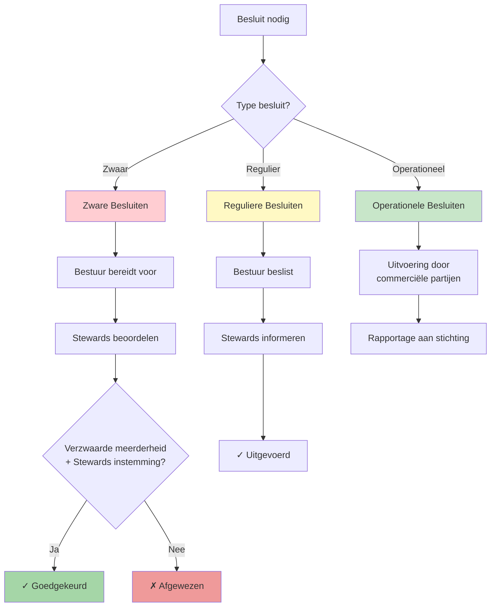

Dit document beschrijft hoe besluiten rondom Epistola worden genomen
en hoe verantwoordelijkheden zijn verdeeld.

---

## Rol van de stichting

De stichting is verantwoordelijk voor:
- missie en doelstelling
- governance en spelregels
- licentie en IP-beheer
- architectuur- en kwaliteitsprincipes
- bewaking van continuïteit en publiek belang

De stichting is niet verantwoordelijk voor:
- dagelijkse operatie
- commerciële prioritering
- projectuitvoering
- SLA-levering aan afnemers

---

## Besluitvorming

### Zware besluiten
Zware besluiten vereisen een verzwaarde meerderheid én instemming van de
stewards volgens het Reglement Stewards.

Voorbeelden:
- wijziging van de missie
- wijziging van de licentie
- overdracht van intellectueel eigendom
- fundamentele wijziging van governance

Doel: bescherming van Epistola op lange termijn.

### Reguliere besluiten
Reguliere besluiten betreffen:
- procesafspraken
- toelating van dienstverleners
- governance-actualisaties
- strategische kaders

Deze besluiten worden genomen door het bestuur of de stewards
volgens vastgestelde procedures.

### Besluitvormingsproces Visualisatie

---

## Rol van stewards in besluitvorming

De stewards bewaken missie, licentie en governance en hebben instemmingsrecht
op zware besluiten (zoals missie/licentie/change date, IP‑overdracht, fundamentele
governance/statutenwijzigingen en ontbinding). Daarnaast keuren zij het jaarplan
en de doelbegroting goed en beschikken zij over informatie- en auditrechten.

Zie: Reglement Stewards voor quorum, drempels en werkwijze.

---

## Principes

- geen enkel belang heeft doorslaggevende macht
- transparante besluitvorming
- vastgelegde stemverhoudingen
- periodieke evaluatie van governance

---

## Operationalisering: Concrete werkwijze

### Quorum en stemverhoudingen

**Bestuur:**
- Minimaal 50% + 1 bestuurders aanwezig voor geldige vergadering
- Reguliere besluiten: eenvoudige meerderheid (50% + 1)
- Zware besluiten: verzwaarde meerderheid (2/3) UIT het bestuur

**Stewards:**
- Minimaal 2/3 stewards aanwezig voor geldige instemming
- Zware besluiten vereisen: 2/3 stewards instemming

**Combinatie zware besluiten:**
- Vereist: 2/3 bestuur ÉN 2/3 stewards
- Instemming stewards is een veto – niet gehaald = niet doorgaan

### Concrete drempel voor zware besluiten

Zware besluiten zijn:
1. Wijziging missie/doel
2. Wijziging licentie (incl. change date)
3. Overdracht intellectueel eigendom
4. Ontbinding stichting
5. Fundamentele wijziging governance/statuten
6. Wezenlijke wijziging margebeleid (> 5% swing)
7. Investering > €50.000 eenmalig OR opschaling FTE

Alle andere besluiten (routinegovernance, toelating leveranciers, jaarplan binnen begroting) zijn regulier.

### Deadlock-procedure

Scenario: Bestuur wil besluit nemen, stewards weigeren instemming.

**Proces:**
1. Schriftelijke bezwaren van stewards (binnen 7 dagen)
2. Formele herbeschouwing met alle partijen (mediatie)
3. Bestuursvoorzitter documenterert bezwaren en overwegingen
4. Hersteming na minstens 14 dagen
5. Wanneer opnieuw deadlock: **onafhankelijke mediator/arbiter**
   - Extern jurist of corporate governance-specialist
   - Bindende uitspraak op inhoud (niet stemming)
6. Publicatie uitspraak en motivering

Dit voorkomt verlamming zonder de beschermende rol van stewards uit te hollen.

### Belangenverstrengeling

**Meldplicht:**
- Bestuurder/steward meldt direct (niet pas bij stemming) als:
  - Zij financieel belang hebben in leverancier
  - Zij werkzaam zijn bij leverancier
  - Familie/nauwe relatie met partij
  - Potentieel conflict met missie

**Gevolg:**
- Onthouding van alle discussie en stemming
- Vertrouwensbreuk kan leiden tot ontslag
- Transparante registratie

---

## Jaarlijkse governance-evaluatie

Jaarlijks moet de stichting evalueren:
- Zijn stewards effectief? Hebben zij toegang tot relevante informatie?
- Zijn besluiten transparant genomen?
- Zijn er conflicten geweest? Hoe opgelost?
- Moet gouvernance-regeling worden aangescherpt?

Dit bevordert adaptatie zonder statutaire breuk.

---

## Zie ook

- [Stewards](/het-model/governance/stewards) - Rol en samenstelling van stewards
- [Reglement Stewards](/het-model/governance/reglement-stewards) - Gedetailleerd reglement voor stewards
- [Statuten](/het-model/governance/statuten) - Statutaire borging van governance
- [Organisatiestructuur](/het-model/structuur-rollen/structuur) - Hoe rollen zijn verdeeld
