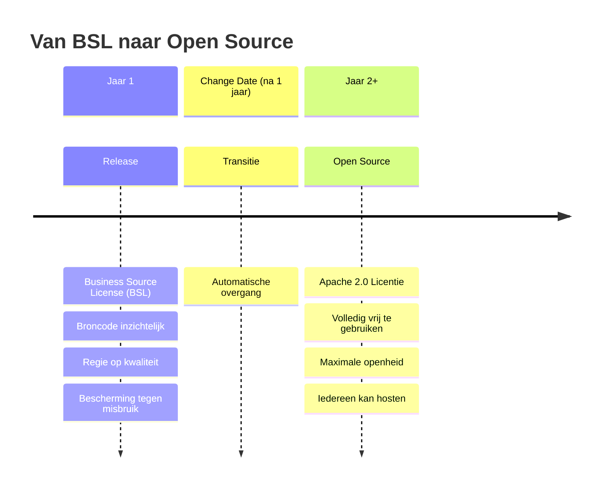

Dit document beschrijft hoe intellectueel eigendom en licenties
rondom Epistola zijn georganiseerd.

---

## Eigendom

Het intellectueel eigendom van Epistola berust bij de stichting.

Dit omvat:
- broncode
- documentatie
- merk en naam
- architectuurprincipes

---

## Licentie

Epistola wordt beschikbaar gesteld onder de Business Source License (BSL)
met een vastgestelde change date van één jaar.

### Licentie Tijdlijn

:::tip[Waarom BSL?]
De BSL geeft **kwaliteitscontrole in de beginfase** terwijl **openheid op lange termijn** gegarandeerd blijft. Na 1 jaar wordt alles volledig open source.
:::

**Dit betekent:**
- De broncode is inzichtelijk en toegankelijk
- Gebruik en doorontwikkeling zijn toegestaan binnen de licentievoorwaarden
- Commerciële exploitatie door derden is gereguleerd
- Na de change date gaat de licentie automatisch over naar een
  OSI-goedgekeurde open source licentie (bijvoorbeeld Apache 2.0)

**Doelen van deze licentie:**
- Regie op kwaliteit en samenhang in de beginfase
- Bescherming tegen free-riding en ongewenste SaaS-exploitatie
- Ruimte voor oprichters en vroege investeerders om hun investering
  terug te verdienen
- Behoud van openheid en overdraagbaarheid op de lange termijn
- Voorkomen van vendor lock-in

:::note[Licentie Beheer]
De stichting beheert en handhaaft de licentie.
Wijzigingen aan de licentie zijn een zwaar besluit en vereisen verzwaarde meerderheid + stewards instemming.
:::

---

## Bijdragen

- Bijdragen worden upstream gedaan
- Private forks worden ontmoedigd
- Bijdragers behouden auteursrecht op hun bijdragen
- De stichting borgt dat bijdragen beschikbaar blijven voor het geheel

---

## Wijzigingen

Wijzigingen aan de licentie zijn zware besluiten
en vereisen een verzwaarde meerderheid.

De change date is beleidsmatig vastgesteld op één jaar.
