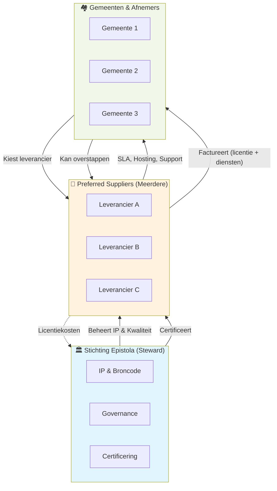

Dit document beschrijft hoe eigendom, governance en dienstverlening
rondom Epistola zijn georganiseerd, in lijn met steward ownership.

---

## Kernprincipe

Epistola wordt beheerd door een onafhankelijke stichting.

De stichting:
- levert zelf geen diensten
- sluit geen contracten met afnemers
- factureert niet

Alle dienstverlening aan afnemers verloopt **uitsluitend via commerciële
partijen**.

---

## Rollen en verantwoordelijkheden

### Stichting Epistola

De stichting is steward van Epistola en beheert governance & architectuur.

Taken:
- Beheer van intellectueel eigendom (broncode, merk, IP-rechten)
- Bewaken van missie, waarden en continuïteit
- Vaststellen van governance, licentie en architectuurprincipes
- Certificering en toezicht op preferred suppliers
- Regie op publieke roadmap-prioriteiten
- Handhaving van naleving (upstream-bijdragen, licentie, compliance)

De stichting:
- voert geen development, operatie of SLA uit
- levert geen support, hosting, training of implementaties
- is geen leverancier richting afnemers
- besteedt contractwerk uit (maar voert zelf niet uit)

De stichting kan wel:
- Externen inhuren voor governance/audit (architect, security consultant)
- Contractwerk geven aan preferred suppliers voor specifieke architectuur-werkzaamheden
- Maar: Deze ingehuurde arbeid is ONDERSTEUNEND aan stewardship, niet development richting gemeentes

---

### Commerciële dienstverleners

Commerciële partijen leveren alle diensten rondom Epistola.

Voorbeelden:
- Zoef.app BV (huidige uitvoerende partij)
- Andere commerciële partijen (nu of in de toekomst)

Taken:
- ontwikkeling en doorontwikkeling
- onderhoud en lifecycle management (SLA / LCM)
- support en incidentafhandeling
- implementaties en migraties

Kenmerken:
- werken binnen de kaders van de stichting
- hebben geen eigendom over Epistola
- concurreren op kwaliteit en expertise

---

### Afnemers / klanten

Afnemers zijn bijvoorbeeld gemeenten en andere organisaties.

Kenmerken:
- sluiten contracten met commerciële dienstverleners
- nemen geen diensten af bij de stichting
- kunnen kiezen tussen meerdere dienstverleners
- behouden altijd toegang tot Epistola als open voorziening

---

## Contractuele relaties

- Afnemer ↔ commerciële partij
  Levering van diensten, SLA/LCM, facturatie

- Stichting ↔ commerciële partijen
  Governance, kaders, kwaliteits- en toelatingsafspraken

- Stichting ↔ afnemers
  Geen directe dienstverlening of facturatie

---

## Doel van deze structuur

Deze structuur:
- voorkomt vendor lock-in
- waarborgt continuïteit
- maakt commerciële dienstverlening mogelijk
- beschermt Epistola als publieke digitale voorziening

## Conflict of interest

Om belangenverstrengeling te voorkomen, hanteert Epistola de volgende
principes:

- De stichting levert zelf geen commerciële diensten.
- Bestuurders en stewards van de stichting hebben geen doorslaggevend
  financieel belang bij commerciële dienstverleners.
- Commerciële dienstverleners hebben geen beslissende zeggenschap over
  missie, licentie of governance.
- Rollen van steward, bestuurder en dienstverlener zijn expliciet
  gescheiden en vastgelegd.
- Bij (potentiële) belangenverstrengeling wordt dit gemeld en leidt dit
  tot onthouding van stemming of besluitvorming.

Deze waarborgen zorgen ervoor dat besluiten altijd worden genomen in het
belang van Epistola als publieke digitale voorziening, en niet in het
belang van één specifieke marktpartij.

---

## Wat als een dienstverlener stopt?

De continuïteit van Epistola is niet afhankelijk van één commerciële
partij.

Wanneer een dienstverlener stopt, failliet gaat of besluit geen diensten
meer te leveren:

- blijft Epistola bestaan onder beheer van de stichting
- blijven broncode, documentatie en intellectueel eigendom beschikbaar
- blijven afnemers eigenaar van hun data
- kan een andere commerciële partij de dienstverlening overnemen
- kunnen afnemers desgewenst zelf een partij kiezen

De stichting borgt dit door:
- het onafhankelijk beheren van het intellectueel eigendom
- open en toegankelijke documentatie
- het stimuleren van meerdere dienstverleners
- het vastleggen van overdraagbaarheid in contractuele kaders

Hierdoor ontstaat geen vendor lock-in en blijft de continuïteit van
Epistola gewaarborgd, ongeacht veranderingen aan de kant van individuele
dienstverleners.

---

## Zie ook

- [Commerciële Partijen](/het-model/structuur-rollen/commerciele-partijen) - Rol en vereisten voor leveranciers
- [Governance](/het-model/governance/governance) - Hoe besluiten worden genomen
- [Steward Ownership](/introductie/steward-ownership) - Het onderliggende eigendomsmodel
- [Licentie & IP](/het-model/ip-licenties/licentie-en-ip) - Eigendom en licentiemodel
