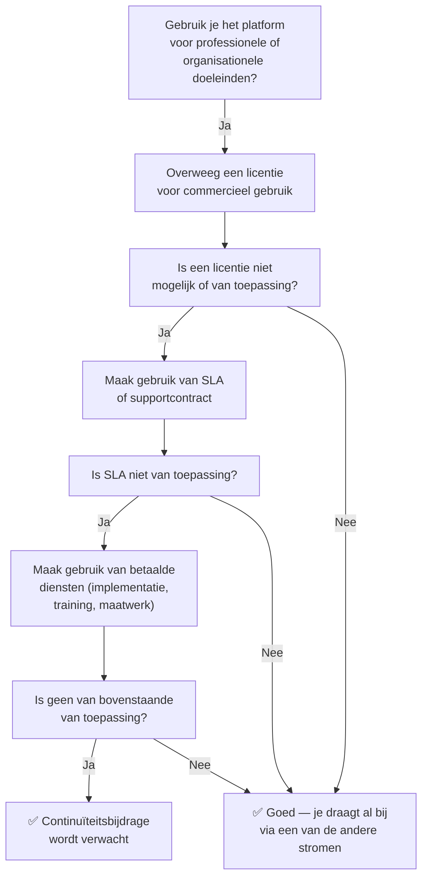

Open source betekent vrij te gebruiken. Maar het betekent niet: zonder verantwoordelijkheid.

Een platform dat structureel gebruikt wordt zonder dat iemand bijdraagt aan het onderhoud, de governance of de doorontwikkeling, houdt het op een gegeven moment op te bestaan. Niet door een dramatisch moment, maar door langzame erosie: patches die uitblijven, architectuur die veroudert, beheerders die afhaken.

De **continuïteitsbijdrage** is de expliciete erkenning van die verantwoordelijkheid. Het is de onderste sport van de escalatieladder: de minimale bijdrage die verwacht wordt van organisaties die het platform gebruiken maar geen licentie, SLA of diensten afnemen.

---

## Het free-rider probleem

In economische termen heet dit het **free-rider probleem**: wie profiteert van een gemeenschappelijk goed zonder bij te dragen aan de instandhouding ervan. Voor open source software is dit een chronisch structureel risico.

Het is zelden kwade wil. Organisaties die open source software gratis gebruiken doen dat vaak simpelweg omdat het kan, en omdat niemand hen heeft verteld dat er een verwachting tegenover staat. Maar op ecosysteemniveau telt elke niet-bijdragende gebruiker mee. Als de meerderheid gratis meelift, draait een kleine minderheid voor de kosten op.

**Als licenties geen optie zijn, moet je op een andere manier bijdragen.** Dat is de kerngedachte achter de continuïteitsbijdrage.

---

## Wanneer is een continuïteitsbijdrage van toepassing?

Gebruik onderstaande beslisboom:

---

## Wat telt als een continuïteitsbijdrage?

Een continuïteitsbijdrage hoeft geen geldbedrag te zijn. Het gaat om een betekenisvolle bijdrage aan het platform of het ecosysteem. De stichting stelt vast wat als meaningful geldt.

**Mogelijke vormen:**

| Vorm | Voorbeeld |
|---|---|
| Upstream code | Bug fix, nieuwe feature, beveiligingspatch — ingediend en geaccepteerd |
| Documentatie | Verbeterde handleiding, vertaling, gebruikersscenario's |
| Financiële donatie | Directe bijdrage aan de stichting |
| Roadmap-bijdrage | Mede-financieren van een feature die collectief beschikbaar komt |
| Testen & feedback | Gestructureerde testrapportage, reproduceerbaarheidsanalyse |

**Wat niet telt:**
- Gebruik van het platform, hoe intensief ook
- Sociale media posts of mond-tot-mondreclame
- Interne documentatie die niet gedeeld wordt

---

## Waarom dit geen liefdadigheid is

De continuïteitsbijdrage is geen "donatie" in de zin van een vrijwillige gunst. Het is een structurele verwachting die voortvloeit uit het gebruik van een gemeenschappelijk goed.

Vergelijk het met een waterleiding in een coöperatieve wijk: iedereen gebruikt water, iedereen betaalt een bijdrage aan het onderhoud. Wie alleen water afneemt zonder ooit bij te dragen aan de leiding, profiteert van de bijdragen van anderen — en ondermijnt op termijn de infrastructuur.

Een open platform voor publieke dienstverlening is niet anders. Duurzaamheid vereist dat bijdragen en gebruik in balans zijn.

---

## Wat stelt de stichting als minimum?

De stichting definieert wat een meaningful bijdrage is. Dit is bewust niet te strikt gespecificeerd, omdat bijdragen in vorm sterk kunnen variëren. Algemene richtlijnen:

- **Code:** Minimaal één geaccepteerde pull request per jaar met substantiële functionaliteit of een relevante bugfix
- **Documentatie:** Een aantoonbare verbetering die door de community is geaccepteerd
- **Financieel:** Een bijdrage die in verhouding staat tot de schaal van het gebruik — richtsnoer: een tiende van de laagste licentieprijs per jaar
- **Roadmap:** Mede-financiering van een feature die de community aantoonbaar ten goede komt

De stichting beoordeelt bijdragen transparant en publiceert jaarlijks welke bijdragen zijn erkend.

---

## Transparantie en handhaving

De stichting publiceert een register van organisaties die bijdragen via de continuïteitsbijdrage. Organisaties die publiekelijk gebruik maken van het platform zonder bij te dragen aan welke inkomstenstroom dan ook, kunnen worden aangesproken.

Handhaving is geen doel op zich. Het doel is een ecosysteem waarin bijdragen de norm zijn — niet de uitzondering.

---

## Zie ook

- [Het Probleem](/introductie/het-probleem) — Waarom dit nodig is
- [Het Verdienmodel: Overzicht](/het-verdienmodel/overzicht) — De escalatieladder volledig
- [Licenties](/het-verdienmodel/licenties) — Commercieel gebruik en licentieprijzen
- [Diensten](/het-verdienmodel/diensten) — Betaalde expertise als alternatief
