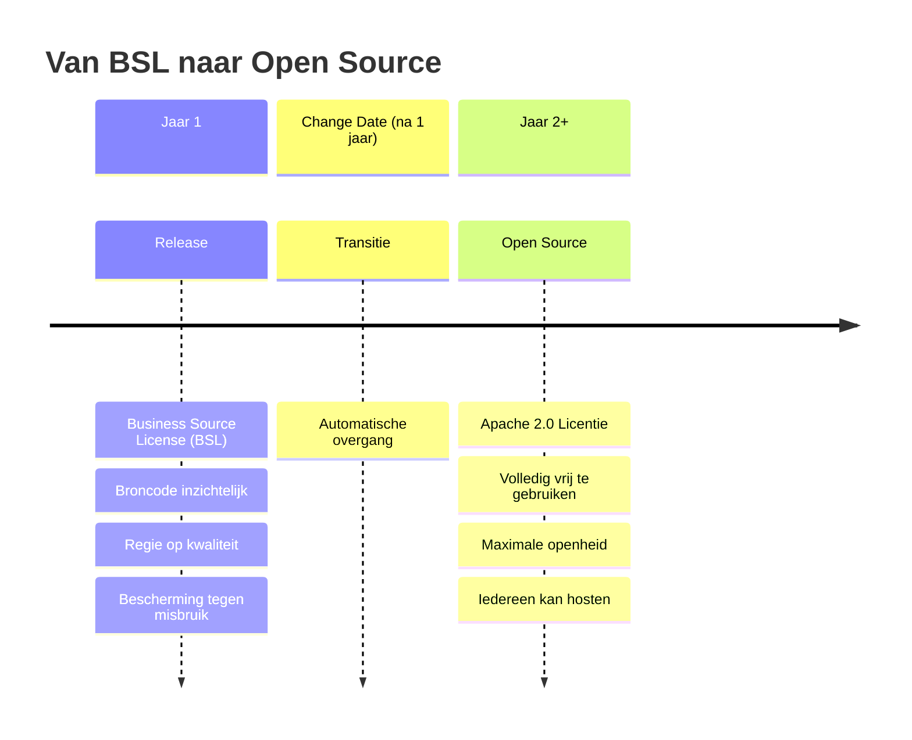
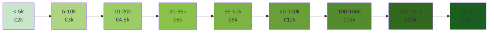

De licentie is de meest voorspelbare bijdragevorm voor de stichting die het platform beheert. Afnemers betalen een jaarlijkse licentiebijdrage — doorbelast door hun preferred supplier — en financieren daarmee de governance en architectuurregie van het platform.

Licenties zijn niet de enige manier om bij te dragen, maar wel de stabielste. Ze maken inkomsten planbaar en onafhankelijk van de goodwill van het moment. Zie [Het Verdienmodel](/het-verdienmodel/overzicht) voor de andere bijdragevormen.

Dit is de **canonieke locatie** voor prijsinformatie. Alle andere pagina's verwijzen hiernaar.

---

## Waarom BSL geen lock-in creëert

Een veelgehoord bezwaar tegen licentiemodellen voor open source software is vendor lock-in. Bij dit model is dat bezwaar niet van toepassing — en wel om een eenvoudige reden.

Na precies één jaar gaat de code automatisch en onherroepelijk over naar **Apache 2.0**: volledig vrij te gebruiken, aan te passen en te hosten door iedereen. Geen restrictie meer. Geen afhankelijkheid van de stichting of van een specifieke leverancier.

Dit heeft een directe consequentie voor de lock-in vraag:

| Situatie | Wat kan een concurrent doen? |
|---|---|
| Licentiecontract is 1 jaar | Na afloop is de code van dat jaar Apache 2.0 — een nieuwe leverancier kan ermee aan de slag |
| Licentiecontract is 3 jaar | Halverwege het contract is de code van jaar 1 al ruim vrij — een nieuwe leverancier kan intrede doen met die basis |
| Stichting houdt op te bestaan | Code gaat onmiddellijk naar Apache 2.0, geen enkele afhankelijkheid resteert |

Met andere woorden: de maximale "lock-in" is één jaar — en in de praktijk nog minder, omdat concurrerende leveranciers al met de vrijgegeven code van voorgaande versies kunnen werken. Wie een meerjaarscontract sluit, zit voor het grootste deel van die periode al in het Apache 2.0-tijdperk van de code.

Het licentiemodel creëert dus **geen duurzame afhankelijkheid**. Het creëert een korte aanloopperiode met kwaliteitsregie, gevolgd door volledige openheid.

[→ Uitgebreide uitleg van hoe de BSL technisch en juridisch werkt](/referentie/bsl-licentie)

---

## Wat voorkomt dat de licentiekosten ineens verdubbelen?

Een terechte vraag: wat houdt de stichting tegen om volgend jaar de prijzen fors te verhogen?

Het korte antwoord: de eigendomsstructuur. De stichting heeft geen aandeelhouders die baat hebben bij hogere prijzen. Bestuurders en stewards profiteren niet van hogere licentie-inkomsten. En prijswijzigingen vereisen een besluitvormingsproces waarbij de stewards — onafhankelijke toezichthouders zonder commercieel belang — instemmingsrecht hebben.

Bovendien geldt: naarmate meer gemeenten meedoen, **dalen** de tarieven (zie schaalvoordelen hieronder) — het model is structureel gericht op toegankelijkheid, niet op maximalisering.

[→ Hoe steward ownership prijsmisbruik structureel voorkomt](/verantwoord-beheer/steward-ownership#bescherming-tegen-prijsverhogingen)

---

## Het licentiemodel: van BSL naar open source

Het platform wordt uitgegeven onder de **Business Source License (BSL)** met een vaste change date van één jaar.

:::tip[Waarom BSL?]
De BSL geeft **kwaliteitscontrole in de beginfase** terwijl **openheid op lange termijn** statutair gegarandeerd blijft. Na 1 jaar wordt de code automatisch en onherroepelijk volledig open source onder Apache 2.0.
:::

**Wat de BSL mogelijk maakt in jaar 1:**
- Broncode is inzichtelijk (geen black box, vertrouwen-builder)
- Kwaliteitsregie: de stichting kan controleren wat er met de code gebeurt
- Bescherming tegen ongewenste SaaS-exploitatie door derden
- Leveranciers en vroege investeerders kunnen hun investering terugverdienen

**Na de change date (Apache 2.0):**
- Iedereen mag de code gebruiken, aanpassen, zelf hosten
- Geen lock-in meer mogelijk via licentie
- Code blijft volledig bruikbaar ook als de stichting ooit ophoudt te bestaan

Het intellectueel eigendom berust bij de stichting. Wijzigingen aan de licentie of de change date zijn **zware besluiten** die een verzwaarde meerderheid + instemming van stewards vereisen.

---

## Prijstabel: licentie per gemeentegrootte

Licenties volgen de gemeentelijke schaal op basis van inwonertal, niet op basis van het aantal gebruikers of documenten. Gebruik is onbeperkt.

| Gemeentegrootte | Inwoners | Licentie/jaar |
|---|---|---|
| Micro | < 5k | €2.000 |
| Zeer klein | 5–10k | €3.000 |
| Klein | 10–20k | €4.500 |
| Klein–mid | 20–35k | €6.000 |
| Mid | 35–60k | €8.000 |
| Mid–groot | 60–100k | €11.000 |
| Groot | 100–150k | €15.000 |
| Zeer groot | 150–250k | €22.000 |
| XL | 250k+ | €30.000 |

:::tip[Schaalvoordelen]
Grotere gemeenten betalen relatief **minder per inwoner**. De entry-barrier is laag voor kleine gemeenten (€2.000/jaar) en realistisch voor grote.
:::

---

## Meerjarencontract: 10% korting

Standaard is een jaarcontract met vooruitbetaling. Bij een 3-jarig contract geldt een korting van 10%.

**Voorbeeld (gemeente 50k inwoners):**
- Jaarcontract: €8.000/jaar
- 3-jarig contract: €8.000 × 3 = €24.000 → **€21.600** (10% korting)

Voordeel voor de afnemer: kostenbesparing en zekerheid over prijs.
Voordeel voor de stichting: langetermijnzekerheid in inkomsten.

---

## Schaalvoordelen bij groei

Naarmate meer gemeenten deelnemen, dalen de licentieprijzen:

| Aantal deelnemende gemeenten | Prijsverlaging |
|---|---|
| 10+ gemeenten | −5% op alle tarieven |
| 20+ gemeenten | −10% op alle tarieven |
| 35+ gemeenten | −15% op alle tarieven |

**Voorbeeld:**
- Jaar 1 (5 gemeenten): gemeente 50k inwoners betaalt €8.000
- Jaar 3 (25 gemeenten): dezelfde gemeente betaalt €7.200 (−10%)
- Jaar 4+ (40+ gemeenten): €6.800 (−15%)

Schaalvoordelen worden doorgegeven bij contractverlenging.

---

## Doorbelasting via preferred suppliers

Gemeenten betalen de licentie **niet rechtstreeks** aan de stichting, maar via hun preferred supplier. De preferred supplier draagt de licentiebijdrage af aan de stichting.

De doorbelasting aan de afnemer is aan een maximum marge gebonden:

| Gemeentegrootte | Maximale marge |
|---|---|
| Klein (< 20k inwoners) | 15% |
| Middelgroot (20–100k) | 12% |
| Groot (100k+) | 10% |

Een preferred supplier mag de licentie dus met een kleine marge doorbelasten, maar kan dit niet als grote winstbron gebruiken. Verdiensten liggen bij SLA, diensten en maatwerk.

---

## Wat financieren licentie-inkomsten?

Licentie-inkomsten gaan uitsluitend naar de stichting, voor:

| Activiteit | Toelichting |
|---|---|
| Governance & stewardship | Bestuur, stewards, audit |
| Architectuurregie | Standaarden, ontwerpprincipes |
| IP-beheer | Licentiehandhaving, merkinstellingen |
| Certificering preferred suppliers | Kwaliteits- en securitytoets |
| Publieke roadmapregie | Bepalen welke features collectief worden gebouwd |
| Upstream-ondersteuning | Zorgen dat maatwerk terugkomt in het platform |

Licentie-inkomsten financieren **niet**:
- SLA, hosting, operatie (preferred supplier)
- Support en training (preferred supplier)
- Custom development (apart betaald door gemeente)
- Gewone bugfixes (upstream-verplichting preferred supplier)

---

## Financiële trajectie van de stichting

| Jaar | Kosten | Inkomsten | Resultaat |
|---|---|---|---|
| 1 (5 gemeenten) | €75.000 | €31.000 | −€44.000 → investering nodig |
| 2 (12 gemeenten) | €120.000 | €96.000 | −€24.000 → bijna break-even |
| 3 (25 gemeenten) | €165.000 | €247.500 | +€82.500 → self-sustaining ✓ |
| 4+ (40 gemeenten) | €240.000 | €437.500 | +€197.500 → innovatiefonds |

Overwinst wordt niet uitgekeerd, maar ingezet voor innovatie, publieke initiatieven en terugbetaling van vroege investeerders (met gemaximeerd rendement).

---

## Bijdragen en upstream

Alle code die preferred suppliers bijdragen gaat **upstream** — er zijn geen private forks. Bijdragers behouden auteursrecht op hun bijdragen; de stichting borgt dat bijdragen beschikbaar blijven voor het geheel.

---

## Zie ook

- [Het Verdienmodel: Overzicht](/het-verdienmodel/overzicht) — De vier inkomstenbronnen
- [SLA & Support](/het-verdienmodel/sla-en-support) — Operationele dienstverlening
- [Structuur & Rollen](/het-model/structuur) — Hoe stichting, suppliers en gemeenten samenwerken
- [Verantwoord Beheer](/verantwoord-beheer/steward-ownership) — Hoe eigenaarschap en governance de licentiegaranties borgen
