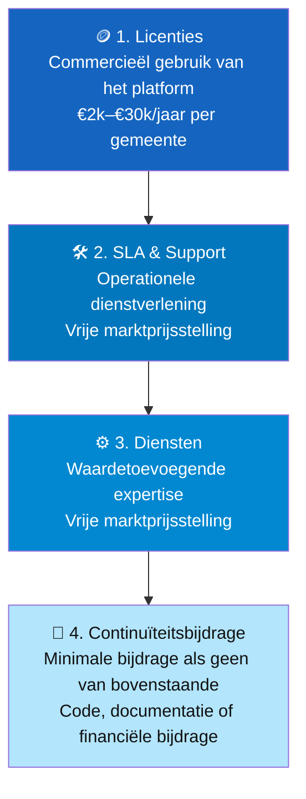
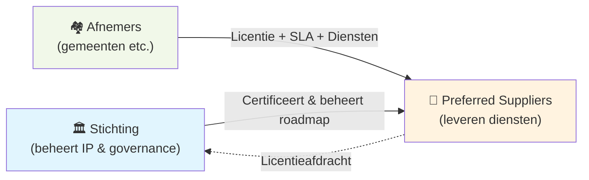

Open source platformsoftware voor de publieke sector heeft een verdienmodel nodig dat eerlijk, schaalbaar en expliciet is. Dit model steunt op vier inkomstenbronnen die geen gelijke alternatieven zijn — ze vormen een **escalatieladder**: van maximale commerciële betrokkenheid tot de minimale bijdrage die een platform in stand houdt.

Epistola past dit model toe als concreet voorbeeld. De principes zijn echter generiek toepasbaar op vergelijkbare open platforms.

---

## De escalatieladder

De ladder loopt van bovenaan (meeste commerciële betrokkenheid, meeste bijdrage) naar onderaan (minimale betrokkenheid, maar nog steeds een expliciete bijdrage). Puur gebruik zonder enige bijdrage valt buiten het model.

---

## Overzicht: de vier inkomstenbronnen

| Inkomstenbron | Wie betaalt? | Wat krijgen ze? | Prijsstelling |
|---|---|---|---|
| **1. Licenties** | Afnemers (via preferred supplier) | Recht op commercieel gebruik van het platform | Vaste schaal (op inwonertal) |
| **2. SLA & Support** | Afnemers | Garanties op beschikbaarheid, patches, support | Vrije markt (per leverancier) |
| **3. Diensten** | Afnemers of leveranciers | Expertise, audits, migraties, maatwerk | Vrije markt (per dienst) |
| **4. Continuïteitsbijdrage** | Organisaties die gebruik maken zonder 1–3 | Gebruik van het platform, bijdrage aan continuïteit | Variabel (code, geld, tijd) |

---

## 1. Licenties

De licentie is de primaire financieringsbron voor de stichting die het platform beheert. Afnemers (zoals gemeenten) betalen een jaarlijkse licentiebijdrage, die door de preferred supplier wordt doorbelast.

De licentieopbrengsten financieren uitsluitend het beheer van het platform:
- Governance en stewardship
- Architectuurregie
- IP-beheer en licentiehandhaving
- Certificering van preferred suppliers
- Publieke roadmapregie

Licenties financieren **geen** ontwikkeling, SLA of support. Die kosten liggen bij de leveranciers.

[→ Meer over licenties en prijzen](/het-verdienmodel/licenties)

---

## 2. SLA & Support

Service Level Agreements zijn de primaire inkomstenbron voor preferred suppliers. Ze bepalen wat een leverancier garandeert op het gebied van beschikbaarheid, responstijden en incidentafhandeling.

SLA-kosten zijn vrij te bepalen door leveranciers en worden uitgedrukt als een vermenigvuldiger van de licentiekosten. Ze concurreren op kwaliteit: een hogere SLA kost meer, maar garandeert ook meer.

[→ Meer over SLA-niveaus en keuze](/het-verdienmodel/sla-en-support)

---

## 3. Diensten

Naast SLA kunnen leveranciers waardetoevoegende diensten aanbieden. Dit zijn geen randproducten — voor veel organisaties zijn dit de meest tastbare reden om een preferred supplier te kiezen.

Voorbeelden van diensten:
- **Template kwaliteitscheck** — audit van bestaande documenten
- **Versie-compatibiliteitsvalidatie** — controle of templates werken na een platformupdate
- **Implementatie & migratie** — begeleiding bij onboarding
- **Training** — opleiding van medewerkers
- **Maatwerk ontwikkeling** — specifieke integraties en uitbreidingen

[→ Meer over diensten](/het-verdienmodel/diensten)

---

## 4. Continuïteitsbijdrage

Dit is de vloer van het model: de bijdrage die verwacht wordt van organisaties die het platform gebruiken maar geen licentie, SLA of diensten afnemen.

Open source betekent niet gratis in de zin van: zonder verantwoordelijkheid. Een platform dat structureel gebruikt wordt zonder bijdrage, overleeft niet. De continuïteitsbijdrage formaliseert die verantwoordelijkheid.

Een continuïteitsbijdrage kan bestaan uit:
- Upstream code- of documentatiebijdragen
- Financiële donatie aan de stichting
- Mede-financieren van een roadmap-feature

[→ Meer over de continuïteitsbijdrage](/het-verdienmodel/continuiteits-bijdrage)

---

## Hoe de drie lagen samenwerken

Het platform wordt beheerd door een stichting. De stichting levert zelf geen diensten. Preferred suppliers leveren alle dienstverlening aan gemeenten en andere afnemers. De stichting ontvangt licentieopbrengsten via de suppliers.

Dit model maakt het mogelijk dat meerdere leveranciers concurreren op kwaliteit van dienstverlening, terwijl het platform zelf beschermd blijft als publieke voorziening.

---

## Zie ook

- [Het Probleem](/introductie/het-probleem) — Waarom een bijzonder verdienmodel nodig is
- [Licenties](/het-verdienmodel/licenties) — Prijsopbouw en wat licenties financieren
- [SLA & Support](/het-verdienmodel/sla-en-support) — Dienstverleningsniveaus
- [Diensten](/het-verdienmodel/diensten) — Waardetoevoegende expertise
- [Continuïteitsbijdrage](/het-verdienmodel/continuiteits-bijdrage) — Bijdragen als licenties geen optie zijn
