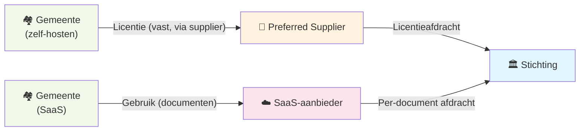

Er is een fundamenteel verschil tussen **zelf-hosten** en **als dienst aanbieden**. Gemeenten die Epistola via een preferred supplier als managed SaaS-dienst afnemen, opereren in een ander model dan gemeenten die het platform op eigen infrastructuur draaien.

De stichting biedt ruimte voor beide — maar de bijdragestructuur verschilt.

---

## Het onderscheid

**Zelf-hosten (on-premise of private cloud)**

De gemeente — of haar preferred supplier — draait een eigen instance van Epistola. De kosten zijn een vaste jaarlijkse licentiebijdrage op basis van het inwonertal van de gemeente.

[→ Zie de prijstabel voor zelf-hosten](/het-verdienmodel/licenties)

**SaaS (multi-tenant cloud)**

Een hosting partij draait één of meerdere gedeelde instances van Epistola en biedt deze als cloud-dienst aan aan meerdere klanten. De klant hoeft geen eigen infrastructuur te beheren; ze betalen voor gebruik. De hosting partij draagt periodiek af aan de stichting op basis van documentvolume.

---

## Afdracht bij SaaS: gebruik-gebaseerd

Bij een SaaS-aanbieding is een vaste licentiebijdrage per klant onpraktisch. Een hosting partij kan tientallen klanten bedienen op dezelfde instance, met sterk variërend volume. Een vaste bijdrage per klant zou óf te hoog zijn voor kleine afnemers óf onvoldoende bij grote volumes.

Daarom geldt bij SaaS-hosting een **gebruik-gebaseerde afdracht**: een klein bedrag per gegenereerd document, af te dragen aan de stichting.

| | Zelf-hosten | SaaS |
|---|---|---|
| **Bijdrage aan stichting** | Vast jaarlijks bedrag (op inwonertal) | Per gegenereerd document |
| **Wie draagt af** | Preferred supplier namens gemeente | SaaS-aanbieder namens klanten |
| **Voorspelbaarheid** | Hoog (voor alle partijen) | Schaalt met volume |
| **Infrastructuur** | Bij gemeente of supplier | Bij SaaS-aanbieder |
| **Geschikt voor** | Gemeenten met eigen IT-capaciteit | Gemeenten die infra willen uitbesteden |

De afdracht per document is zo gekalibreerd dat de totale bijdrage bij gemiddeld gebruik vergelijkbaar uitkomt met de vaste licentiebijdrage. De variabiliteit ligt bij de SaaS-aanbieder — niet bij de individuele afnemer.

---

## Waarom gebruik-gebaseerd?

Een vast bedrag per klant benadeelt SaaS-aanbieders die kleine klanten bedienen of klanten met laag volume. Het vormt ook een drempel voor kleine gemeenten om voor SaaS te kiezen.

Gebruik-gebaseerde afdracht heeft twee voordelen:

**Proportionaliteit** — wie het platform meer gebruikt, draagt meer bij aan het onderhoud. Dat is eerlijker dan een vaste bijdrage ongeacht gebruik.

**Doorbelastbaarheid** — de SaaS-aanbieder kan de afdracht als onderdeel van de gebruikskosten doorbelasten, vergelijkbaar met hoe cloudproviders compute-kosten doorbelasten. De klant betaalt per document of per periode; een deel daarvan gaat naar de stichting.

---

## Wie kan SaaS aanbieden?

SaaS-aanbieders zijn gecertificeerde preferred suppliers die voldoen aan aanvullende eisen voor multi-tenant hosting:

- **Klant-isolatie** — data en configuratie van één klant is volledig gescheiden van andere klanten
- **Transparante rapportage** — het documentvolume wordt periodiek (maandelijks of kwartaallijks) gerapporteerd aan de stichting
- **Afdracht** — de stichting ontvangt de gebruik-gebaseerde bijdrage op basis van die rapportage
- **Data-portabiliteit** — klanten kunnen hun data en templates altijd exporteren, zonder belemmeringen

Er is **geen exclusiviteit**: meerdere partijen kunnen SaaS-hosting aanbieden en concurreren op kwaliteit, prijs en service. Klanten kunnen wisselen tussen SaaS-aanbieders, of op elk moment overstappen naar zelf-hosten.

---

## Samenspel met het bredere verdienmodel

De SaaS-afdracht is de gebruik-gebaseerde equivalent van de vaste licentie — beide financieren hetzelfde: de governance, architectuur en continuïteit van het platform via de stichting.

Beide routes landen bij de stichting. De route verschilt; het doel — platform onderhouden als publieke voorziening — niet.

---

## Voor gemeenten: wanneer SaaS?

**SaaS is geschikt als:**
- Je geen eigen IT-infrastructuur wilt beheren voor dit platform
- Je snel wilt starten zonder een implementatietraject
- Je gebruik wilt schalen zonder capaciteitsplanning

**Zelf-hosten is geschikt als:**
- Je volledige controle wilt over data en omgeving
- Je integreert met bestaande on-premise infrastructuur
- Je voldoet aan interne vereisten die dataverwerking buiten eigen beheer uitsluiten

De keuze heeft geen invloed op de kwaliteit van het platform of de bijdrage aan de stichting.

---

## Zie ook

- [Licenties](/het-verdienmodel/licenties) — Prijsmodel voor zelf-hosten
- [SLA & Support](/het-verdienmodel/sla-en-support) — Dienstverleningsniveaus voor SaaS-aanbieders en preferred suppliers
- [Structuur & Rollen](/verantwoord-beheer/structuur) — Hoe preferred suppliers worden gecertificeerd
