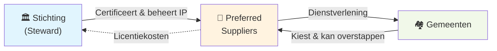

Dit is een beknopt overzicht van het model. Voor elke component zijn er aparte pagina's met meer detail.

---

## Drie lagen, één platform

**Stichting (steward):** Beheert het intellectueel eigendom, certificeert leveranciers, bewaakt de missie. Levert zelf geen diensten aan gemeenten.

**Preferred suppliers:** Meerdere gecertificeerde commerciële partijen die concurreren op kwaliteit. Leveren SLA, hosting, support, implementatie en maatwerk.

**Gemeenten & afnemers:** Kiezen een preferred supplier naar keuze, kunnen altijd overstappen. Betalen via één factuur.

---

## Het verdienmodel: vier inkomstenbronnen

Het platform heeft vier inkomstenbronnen die een escalatieladder vormen:

| # | Inkomstenbron | Voor wie? | Prijsstelling |
|---|---|---|---|
| 1 | **Licenties** | Afnemers (via supplier) | Vaste schaal op inwonertal (€2k–€30k) |
| 2 | **SLA & Support** | Afnemers | Vrije markt per supplier |
| 3 | **Diensten** | Afnemers | Vrije markt per dienst |
| 4 | **Continuïteitsbijdrage** | Gebruikers zonder 1–3 | Code, documentatie of donatie |

De logica: wie meer betrokken is bij het platform, heeft meer formele bijdrageopties. Maar zelfs wie alleen gebruik maakt van de open source versie na jaar 1, wordt gevraagd iets terug te doen.

[→ Meer over het verdienmodel](/het-verdienmodel/overzicht)

---

## Licentie: van BSL naar open source

Het platform gaat na één jaar automatisch van Business Source License naar Apache 2.0. Dit is statutair gewaarborgd en kan niet worden teruggedraaid zonder supermeerderheid.

- **Jaar 1:** Broncode inzichtelijk, kwaliteitsregie, bescherming tegen ongewenst hergebruik
- **Jaar 2+:** Volledig open source, iedereen mag forken, zelf hosten, aanpassen

[→ Meer over het licentiemodel](/het-verdienmodel/licenties)

---

## Vier spanningen opgelost

Het model is ontworpen om vier fundamentele spanningen op te lossen die traditionele modellen niet aankunnen:

| Spanning | Traditioneel | Dit model | Trade-off |
|---|---|---|---|
| **Financiering** | Exit-druk of onzekere subsidies | ROI-cap + licentie-inkomsten | Beperkt groei-potentieel |
| **Missie** | "Vertrouwen op bestuur" | Steward ownership + statuten | Besluiten duren langer |
| **Openheid** | 0% of 100% | Gefaseerd (BSL→Apache 2.0) | 1 jaar niet volledig open |
| **Markt** | Lock-in of fragmentatie | Certified suppliers + standaarden | Coördinatie-overhead |

[→ Meer over steward ownership](/verantwoord-beheer/steward-ownership)

---

## Continuïteit gewaarborgd

Als een preferred supplier stopt, blijft het platform bestaan. Als de stichting ooit zou ophouden te bestaan, gaat het IP automatisch naar het publieke domein (Apache 2.0). Gemeenten zijn nooit afhankelijk van één partij.

---

## Zie ook

- [Het Probleem](/introductie/het-probleem) — Waarom dit model nodig is
- [Het Verdienmodel](/het-verdienmodel/overzicht) — De vier inkomstenbronnen uitgebreid
- [Verantwoord Beheer](/verantwoord-beheer/steward-ownership) — Governance en eigenaarschap
- [Snelstart per Doelgroep](/introductie/snelstart) — Directe informatie voor uw rol
