## Wat is Epistola?

Epistola is een **open platform voor digitale documentgeneratie** dat gemeenten en andere publieke organisaties helpt om op een veilige, gestandaardiseerde manier documenten (brieven, vergunningen, oproepingen) te genereren en uit te sturen aan burgers en bedrijven.

Het belangrijkste onderscheid: Epistola is **eigendom van een onafhankelijke stichting**, niet van één commerciële leverancier. Hierdoor ontstaat geen vendor lock-in en kunnen meerdere bedrijven diensten leveren op basis van hetzelfde platform.

> **Benieuwd naar het WAAROM?** Dit model oplossingen voor pijnpunten waar andere modellen tekortschieten. Lees [Waarom Dit Model](/introductie/waarom-dit-model) voor een uitgebreide toelichting.

---

## Kernprincipes

Het Epistola-model is gebouwd op zeven kernprincipes:

1. **Publiek belang boven commercieel belang**
   De missie en continuïteit van Epistola gaan voor op winstmaximalisatie.

2. **Open bron als uitgangspunt; open source na change date (1 jaar)**
   Code is vanaf dag één inzichtelijk. Na één jaar wordt het volledig open source onder Apache 2.0 licentie.

3. **Geen vendor lock-in**
   Gemeenten kunnen altijd overstappen naar een andere leverancier of zelf hosten, zonder dataverlies of discontinuïteit.

4. **Continuïteit en duurzaamheid**
   Het platform blijft bestaan, zelfs als individuele leveranciers stoppen.

5. **Transparante governance**
   Besluitvorming, financiën en roadmap zijn openbaar en worden bewaakt door onafhankelijke stewards.

6. **Meerdere aanbieders mogelijk**
   Commerciële partijen concurreren op kwaliteit van dienstverlening, niet op eigendom van de software.

7. **Schaalvoordelen delen**
   Naarmate meer organisaties deelnemen, dalen de kosten en worden deze voordelen doorgegeven aan gebruikers.

---

## Hoe werkt het?

### De drie lagen

```mermaid
flowchart LR
    A["🏛️ Stichting<br/>Epistola"] -->|Certificeert & Beheert IP| B["🏢 Preferred<br/>Suppliers"]
    B -->|Dienstverlening| C["🏘️ Gemeenten"]
    C -->|Kiest & Kan overstappen| B
    B -.->|Licentiekosten| A

    style A fill:#e1f5fe
    style B fill:#fff3e0
    style C fill:#f1f8e9
```

**1. Stichting Epistola (Steward)**
- Beheert intellectueel eigendom (broncode, merk, architectuur)
- Bewaakt missie, kwaliteit en continuïteit
- Certificeert commerciële leveranciers
- Investeert in publieke roadmap
- Levert zelf **geen diensten** aan gemeenten

**2. Preferred Suppliers (Dienstverlening)**
- Meerdere gecertificeerde bedrijven
- Leveren SLA, hosting, support, implementatie
- Bouwen features (collectief gefinancierd of custom)
- Concurreren op kwaliteit en prijs
- Moeten bijdragen upstream (no lock-in)

**3. Gemeenten & Afnemers (Gebruikers)**
- Contracteren met preferred supplier naar keuze
- Betalen via één factuur (licentie + diensten)
- Kunnen altijd overstappen
- Behouden eigendom van data

---

## Waarom dit model?

### Voor gemeenten
- ✅ Betaalbaar en transparant
- ✅ Keuzevrijheid tussen leveranciers
- ✅ Geen vendor lock-in
- ✅ Continuïteit gegarandeerd

### Voor leveranciers
- ✅ Eerlijk speelveld
- ✅ Verdienen aan dienstverlening
- ✅ Kunnen investeren in innovatie
- ✅ Groeiende markt

### Voor de samenleving
- ✅ Publiek eigendom
- ✅ Open source
- ✅ Duurzaam en schaalbaar
- ✅ Geen kapitaalverstrengeling

**Wil je begrijpen waarom dít model noodzakelijk is?** Lees [Waarom Dit Model](/introductie/waarom-dit-model) voor een uitgebreide toelichting op de ontwerpkeuzes, trade-offs, en waarom eenvoudiger alternatieven tekortschieten.

---

## Financiering

Het model is financieel zelfdragend vanaf jaar 3:

- **Jaar 1:** Startinvestering nodig (€80-100k)
- **Jaar 2:** Bijna break-even
- **Jaar 3:** Volledig self-sustaining (€247k inkomsten vs €165k kosten)

Inkomsten komen uit:
- Licentiekosten (€2-30k per gemeente/jaar, afhankelijk van schaal)
- Certificeringsfees van preferred suppliers
- Optioneel: investeringen met ROI-cap

Overwinst gaat naar:
- Innovatie en doorontwikkeling
- Publieke initiatieven
- Schaalvoordelen (lagere prijzen)

---

## Licentie: van BSL naar Open Source

**Jaar 1:** Business Source License (BSL)
- Code is inzichtelijk en toegankelijk
- Regie op kwaliteit en veiligheid
- Bescherming tegen ongewenste SaaS-exploitatie

**Jaar 2+:** Apache 2.0 (volledig open source)
- Iedereen mag gebruiken, aanpassen, zelf hosten
- Maximale openheid en herbruikbaarheid

Deze aanpak combineert kwaliteitscontrole in de beginfase met volledige openheid op de lange termijn.

---

## Wie is betrokken?

### Stichting
- **Bestuur:** 3-5 personen, meerderheid onafhankelijk
- **Stewards:** 5-9 personen (onafhankelijke experts, gebruikers, technische specialisten)
- **Adviseurs:** Juridisch, security, architectuur

### Oprichters & Early Investors
- Zoef.app BV (oprichter & eerste investor, €100k met 1.5x ROI-cap)
- Open voor andere impact investors

### Stakeholders
- Nederlandse gemeenten (doelgroep)
- Publieke partners (VNG, ICTU)
- Preferred suppliers (dienstverleners)

---

## Volgende stappen

Wil je meer weten?

- **Voor gemeenten:** Bekijk de [Quick Start voor Gemeenten](/meedoen/gemeenten/one-pager)
- **Voor leveranciers:** Lees de [Quick Start voor Leveranciers](/meedoen/leveranciers/one-pager)
- **Voor investeerders:** Zie het [Investeringsperspectief](/meedoen/investeerders/investeringsperspectief)
- **Meer details:** Verken het volledige [Governance Model](/het-model/governance/governance)
