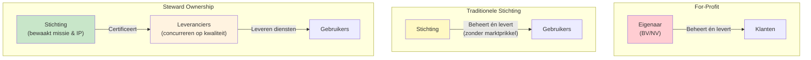

Een commerciële organisatie heeft een sterke kwaliteitsprikkel maar structurele lock-in. Een traditionele stichting beschermt de missie maar heeft geen kwaliteitsprikkel. Steward ownership lost dit op door eigendom en uitvoering te scheiden.

---

## De traditionele stichting

Een stichting of vereniging zonder winstoogmerk. De missie is statutair verankerd. Er is geen aandeelhouder die exit wil.

**Wat werkt:**
- Missie is beschermd — geen commerciële druk om af te wijken
- Geen lock-in via eigenaarschap
- Vertrouwen bij publieke organisaties

**Wat niet werkt:**

*Geen commerciële prikkel voor kwaliteit.* Als er geen concurrentie is en geen markt, is er geen mechanisme dat slechte kwaliteit bestraft of goede kwaliteit beloont. Niet-commerciële organisaties kunnen stagneren zonder dat iemand het voelt.

*Financieel fragiel.* Stichtingen zijn afhankelijk van subsidies, donaties of contributies. Die zijn onzeker, onregelmatig en politiek gevoelig.

*Uitvoering zonder expertise.* Een stichting die zelf software bouwt en onderhoudt, moet technische expertise intern opbouwen zonder de salarisverhoudingen die de markt biedt. Dat lukt zelden structureel.

---

## Steward ownership

Steward ownership combineert wat bij de andere twee vormen niet samengaat: **niet-commercieel eigendom van de kern, gecombineerd met commerciële uitvoering door meerdere concurrerende leveranciers.**

De stichting bezit het platform. Ze kan het niet verkopen, niet privatiseren, en keert geen winst uit. De missie is statutair geborgd.

Maar de stichting levert zelf niets. Alle dienstverlening — hosting, support, implementatie, doorontwikkeling — wordt gedaan door gecertificeerde commerciële leveranciers die onderling concurreren. Die concurrentie is de kwaliteitsprikkel die bij de traditionele stichting ontbreekt.

---

## De vergelijking

| | For-Profit | Traditionele Stichting | Steward Owned |
|---|---|---|---|
| **Missie beschermd** | Risico bij exit of druk | Ja | Ja, statutair |
| **Vendor lock-in** | Structureel risico | Laag | Structureel voorkomen |
| **Kwaliteitsprikkel** | Sterk (markt) | Zwak | Sterk (concurrentie tussen leveranciers) |
| **Continuïteit** | Afhankelijk van eigenaar | Afhankelijk van financiering | Structureel geborgd |
| **Financiële duurzaamheid** | Winstgedreven | Afhankelijk van subsidies | Licenties + diensten |
| **Meerdere leveranciers mogelijk** | Nee (eigenaar controleert) | Soms | Ja, expliciet ontworpen |

---

## Wat steward ownership anders maakt

Het sleutelprincipe is de **scheiding van eigendom en uitvoering**:

- De stichting is eigenaar van de software, de licentie en de roadmapprincipes — maar levert zelf niets
- Commerciële leveranciers leveren alles — maar bezitten niets

Dat betekent: de commerciële prikkel voor kwaliteit bestaat (leveranciers concurreren), maar de commerciële prikkel voor lock-in bestaat niet (de stichting is niet te koop, en de code gaat na een jaar sowieso open source).

---

## Structurele garanties

Het verschil met "we beloven het" is juridisch en structureel:

| Garantie | Hoe geborgd? |
|---|---|
| Licentie gaat na 1 jaar naar Apache 2.0 | Statutair vastgelegd, zware besluit om te wijzigen |
| Platform kan niet worden overgenomen | Stichting heeft geen aandeelhouders, statuten verbieden dit |
| Winst kan niet worden uitgekeerd | Statutair verbod op winstuitkering |
| Stewards hebben geen eigenbelang | Onafhankelijkheidseis in samenstelling |
| Missie-wijziging vereist supermeerderheid | Zwaar besluit: 2/3 bestuur + 2/3 stewards |
| IP blijft beschikbaar bij opheffing | Statutair: bij ontbinding gaat de code direct over naar Apache 2.0 |

---

## Bescherming tegen prijsverhogingen

Een legitieme zorg bij elk licentiemodel: wat voorkomt dat de licentiekosten volgend jaar verdubbelen?

In de software-industrie zijn "rug pulls" geen hypothetisch risico. Unity verhoogde in 2023 plotseling de runtime fees voor elke game-installatie — inclusief al gepubliceerde games. Elastic en HashiCorp stapten over naar restrictievere licenties nadat ze jarenlang groei hadden opgebouwd op hun open source reputatie.

Steward ownership voorkomt dit structureel:

| Waarborg | Hoe geborgd? |
|---|---|
| Stichting kan niet worden overgenomen | Geen aandeelhouders; statuten verbieden overname en privatisering |
| Bestuurders profiteren niet van hogere prijzen | Scheiding van financieel belang en zeggenschap |
| Prijswijzigingen vereisen stewardinstemming | Zware besluitvorming; stewards hebben geen commercieel belang |
| Schaalvoordelen zijn verankerd | Naarmate meer klanten meedoen, dalen de prijzen — niet stijgen |
| BSL change date is onherroepelijk | Kan niet worden teruggedraaid; code wordt altijd Apache 2.0 na 1 jaar |
| Code gaat direct over naar Apache 2.0 bij ontbinding | Geen scenario waarbij code achter slot verdwijnt |

De kern: de stichting heeft **geen aandeelhouders die winst willen maximaliseren**. Hogere licentieprijzen leveren de stichting niets op buiten wat nodig is voor haar missie.

---

## Stewards: de wakers van de missie

Stewards zijn onafhankelijke personen die toezien op de missie en de governance. Ze hebben **geen financieel belang** in commerciële leveranciers en kunnen niet profiteren van de waardeontwikkeling van het platform.

**Samenstelling (5–9 personen):**
- Minimaal 2 onafhankelijke experts (juridisch, technisch, public governance)
- 1–3 gebruikersvertegenwoordigers (gemeenten)
- 1–3 technische stewards (architectuur, security)
- Maximaal 1 vertegenwoordiger van een preferred supplier

**Instemmingsrecht bij zware besluiten:**
- Missiewijziging
- Licentiewijziging of aanpassing van de change date
- IP-overdracht
- Fundamentele governance-wijzigingen
- Statutenwijziging
- Ontbinding

---

## Zie ook

- [For-Profit](/organisatiestructuur/for-profit) — Waarom commercieel eigenaarschap structureel wringt
- [Cost-Recovery Model](/organisatiestructuur/cost-recovery) — Hoe schaal leidt tot lagere prijzen
- [Governance](/epistola/governance/governance) — Hoe besluiten worden genomen
- [Stewards](/epistola/governance/stewards) — Wie de stewards zijn en wat ze doen
