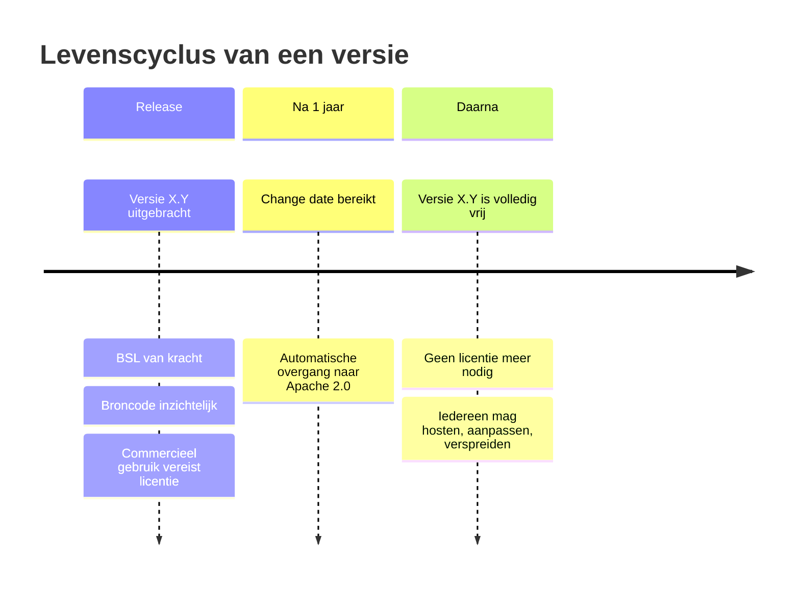

De Business Source License (BSL) is geen traditionele open source licentie — en ook geen traditionele commerciële licentie. Het is een **tijdelijk beperkende broncode-licentie** die na een vaste periode automatisch en onherroepelijk overgaat in een volledig vrije open source licentie.

---

## De drie kernelementen

### 1. Broncode is altijd inzichtelijk

Anders dan bij propriëtaire software is de broncode van BSL-software publiek beschikbaar. Je kunt lezen hoe het werkt, het inspecteren, auditen en aanpassen — ook zonder commerciële licentie.

### 2. Commercieel gebruik vereist een licentie (tijdelijk)

Elke BSL-licentie bevat een "Additional Use Grant" die precies definieert wat zonder licentie is toegestaan. Voor commercieel gebruik — zoals het aanbieden van de software als dienst aan derden — is een licentieovereenkomst nodig zolang de software jonger is dan één jaar.

### 3. Na de change date: volledige Apache 2.0

Na precies de opgegeven periode — in dit geval één jaar — gaat de licentie **automatisch en onherroepelijk** over naar Apache 2.0. Geen actie nodig, geen kosten, geen voorwaarden. De code is dan volledig vrij voor iedereen en voor elk gebruik.

---

## Wat de BSL toestaat zonder licentie

| Gebruik | Toegestaan zonder licentie? |
|---|---|
| Broncode lezen en inspecteren | Ja |
| Lokaal draaien voor ontwikkeling en testen | Ja |
| Test- en acceptatie-omgevingen (onbeperkt) | Ja |
| **Niet-commercieel gebruik (onbeperkt)** | **Ja — volledige gratis licentie** |
| Commercieel productiegebruik tot 200 documenten per dag | Ja |
| Commercieel productiegebruik boven 200 documenten per dag | Nee — licentie vereist |
| Bijdragen aan het project (patches, bugfixes) | Ja |
| Gebruik van de Apache 2.0-versie (ouder dan 1 jaar) | Ja, volledig |
| Aanbieden als dienst aan derden | Nee — preferred supplier + afdracht vereist |

### Wat "commercieel gebruik" betekent

In dit model betalen gemeenten de licentie niet rechtstreeks — de preferred supplier draagt de licentiebijdrage af aan de stichting en belast dit door aan de gemeente. Een gemeente die het platform intern gebruikt via een gecertificeerde supplier, handelt niet zelf als licentiehouder.

---

## De Additional Use Grant: gratis gebruiksruimte

Elke BSL-licentie definieert een **Additional Use Grant**: de gebruiksruimte die zonder licentie is toegestaan, bovenop wat de BSL standaard toelaat. Voor Epistola is die grant bewust ruim opgezet:

- **Niet-commercieel gebruik**: onbeperkt en volledig gratis — geen volumegrens, geen voorwaarden
- **Test- en acceptatie-omgevingen**: onbeperkt voor iedereen, ook commercieel
- **Commercieel productiegebruik**: tot **200 documenten per dag**, per organisatie

Pas wanneer een commerciële organisatie structureel meer dan 200 documenten per dag in productie genereert, is een licentie vereist.

### Wat dit voor wie betekent

| Type organisatie | Praktische gevolgen |
|---|---|
| Niet-commercieel (onderzoek, onderwijs, hobby, vrijwilligers, NGO's) | Volledig gratis, geen volumegrens |
| Klein commercieel bedrijf (productie ≤ 200 docs/dag) | Volledig gratis |
| Bedrijf met groeiend volume | Gratis tot 200 docs/dag; licentie zodra dat structureel overschreden wordt |
| Gemeenten via preferred supplier | Vallen onder het gemeentelicentiemodel — niet onder deze grant |
| SaaS-aanbieders die het platform aan derden leveren | Vallen onder de preferred-supplier-afdracht — niet onder deze grant |

### Waarom een gratis tier?

1. **Lage drempel** — Kleine partijen kunnen het platform integreren zonder eerst een commerciële onderhandeling te starten
2. **Eerlijke verdeling** — Wie het platform op kleine schaal gebruikt, raakt de onderhoudslast nauwelijks; een licentie vragen voor zulk gebruik staat niet in verhouding
3. **Validatiepad** — Organisaties die overwegen het op grotere schaal in te zetten, kunnen het eerst beproeven zonder commerciële verplichting

200 documenten per dag is ruim genoeg om voor een klein team of organisatie een volwaardig productiegebruik te zijn, maar laat de structurele kostenbasis van het platform onveranderd.

---

## Hoe de change date werkt

Het meest kenmerkende element van de BSL is de **change date**: een vaste termijn waarna de licentie automatisch overgaat in Apache 2.0.

**Kenmerken van de change date in dit model:**

- **Automatisch**: geen tussenkomst nodig van de stichting of leverancier
- **Onherroepelijk**: eenmaal vrijgegeven code kan niet worden teruggetrokken
- **Per versie**: elke release heeft zijn eigen change date, één jaar na die release
- **Transparant**: de change date staat in het licentiedocument van elke versie
- **Statutair geborgd**: aanpassing van de change date vereist instemmingsrecht van de stewards

Concreet: de code van versie X.Y is altijd vrij te gebruiken zodra die versie meer dan één jaar oud is — ongeacht wie de stichting bestuurt, of de stichting nog bestaat, of er een conflict is.

---

## Kan de licentie nog veranderen?

Een terechte zorg, gegeven de precedenten van HashiCorp (Terraform), Elastic en MongoDB die hun licentie unilateraal verzwaarden. In het Epistola-model is dat scenario **structureel onmogelijk gemaakt** — niet door beloften, maar door waarborgen die in elkaar grijpen.

### Vier waarborgen, samen sluitend

1. **Statutair vastgelegd** — De statuten leggen vast dat het intellectueel eigendom bij de stichting berust en dat wijziging van de licentie als zwaar besluit geldt (Artikel 6). Zware besluiten vereisen een verzwaarde meerderheid en toetsing aan het doel van de stichting (Artikel 10).
2. **Stewards hebben instemmingsrecht** — De stewards zijn extern benoemde toezichthouders. Een licentiewijziging vereist hun expliciete instemming. Stewards zijn statutair verplicht het doel van de stichting voorop te stellen, niet financiële belangen.
3. **De change date werkt onafhankelijk van besluiten** — Elke versie ouder dan één jaar is al onherroepelijk Apache 2.0. Een hypothetische licentiewijziging op de nieuwste versie verandert daar niets aan: de bestaande, vrijgegeven code blijft vrij en is forkbaar.
4. **Bij ontbinding gaat de code direct over naar Apache 2.0** — Artikel 11 borgt dat het IP niet kan overgaan naar een commerciële partij of bestuurders. In de praktijk betekent dit dat alle nog-BSL code onmiddellijk wordt vrijgegeven onder Apache 2.0; de community kan ongestoord doorbouwen op de bestaande basis.

### Het HashiCorp-precedent — waarom dat hier niet kan

HashiCorp wijzigde in 2023 de licentie van Terraform unilateraal van MPL naar BSL. Dat kon omdat HashiCorp een beursgenoteerd for-profit-bedrijf was met het IP volledig in eigen handen, en de board kon besluiten vanuit aandeelhoudersbelang.

| Voorwaarde voor unilaterale wijziging | HashiCorp | Stichting Epistola |
|---|---|---|
| Rechtsvorm | For-profit, beursgenoteerd | Stichting zonder winstoogmerk |
| IP-eigendom | Bij bedrijf | Statutair bij stichting |
| Besluitvormingsmacht | Board autonoom | Bestuur + steward-instemming + doel-toetsing |
| Externe druk | Aandeelhouders, exit-belang | Geen aandeelhouders, geen exit-druk |

De community-fork (OpenTofu) was bij HashiCorp het noodscenario. In dit model is die fork-route nooit als enige redmiddel nodig, omdat de wijziging zelf structureel verhinderd wordt.

### Het worst-case scenario

Stel — onwaarschijnlijk — dat alle waarborgen tegelijkertijd falen en een licentiewijziging toch wordt doorgevoerd. Wat dan?

1. Alle versies ouder dan één jaar staan al onder Apache 2.0 — vrij en forkbaar
2. Een rechtsgang tegen statutair-strijdige besluitvorming staat open
3. De community kan op basis van de vrijgegeven Apache 2.0-code direct een fork starten — precies wat OpenTofu na de HashiCorp-switch deed

Met andere woorden: zelfs in een totaal falenscenario blijft er een werkend, vrij platform beschikbaar. De vraag "wat als jullie de licentie veranderen?" heeft geen scenario waarin afnemers met lege handen staan.

---

## BSL versus andere licenties

| | BSL | AGPL | SSPL | Propriëtair | Dual licensing |
|---|---|---|---|---|---|
| **Broncode inzichtelijk** | Ja | Ja | Ja | Nee | Ja (community) |
| **Vrij voor intern gebruik** | Beperkt | Ja (copyleft) | Beperkt | Nee | Beperkt |
| **Vrij voor commercieel gebruik** | Niet in jaar 1 | Ja (copyleft) | Beperkt | Nee | Nee |
| **Wordt volledig vrij** | Ja (na 1 jaar) | Al vrij | Nee | Nee | Nee |
| **Copyleft** | Nee | Sterk | Sterk | Nee | Nee |
| **Maximale lock-in** | 1 jaar | Geen | Permanent | Permanent | Permanent |

### AGPL

De Affero GPL is een sterk copyleft-licentie: wie de software als dienst (SaaS) aanbiedt, moet de volledige broncode vrijgeven — inclusief aanpassingen. Dat weerhoudt sommige commerciële partijen van gebruik. Er is geen tijdscomponent: AGPL-code wordt niet automatisch vrijer.

### SSPL (Server Side Public License)

MongoDB en Elastic kozen de SSPL als reactie op cloud providers die hun software als managed service aanboden zonder bij te dragen. De SSPL is zo restrictief dat het Open Source Initiative het niet erkent als open source. Er is geen automatische overgang naar een vrije licentie — SSPL-code blijft permanent beperkt.

### Dual licensing

Een gratis communityeditie naast een betaalde enterprise-editie. Dit model creëert twee permanente versies. De enterprise-editie blijft altijd betaald. Er is geen moment waarop de software volledig vrij wordt.

### Propriëtair

Geen broncode, geen vrijgave, permanente afhankelijkheid van één leverancier.

---

## Bekende BSL-gebruikers

De BSL is in 2016 ontworpen door MariaDB en sindsdien gebruikt door diverse projecten:

- **HashiCorp** — Terraform, Vault, Consul (overstap van MPL naar BSL in 2023)
- **Sentry** — foutmonitoringplatform
- **MariaDB** — de uitvinder van de BSL
- **CockroachDB** — distributed database
- **Couchbase** — NoSQL database

De HashiCorp-overstap leidde tot het forken van Terraform als **OpenTofu** (nu onder de Linux Foundation) — op basis van de laatste Apache 2.0-versie vóór de BSL-switch. Dit laat zien dat de community-fork optie altijd bestaat: de vrijgegeven versies zijn en blijven beschikbaar.

---

## Wat gebeurt er als de stichting ophoudt te bestaan?

Dit is een cruciale vraag voor software waarvan gemeenten jarenlang afhankelijk zijn.

Bij de BSL in dit model gelden twee lagen van bescherming:

**Laag 1 — De change date werkt automatisch:**
Elke versie gaat na één jaar sowieso over naar Apache 2.0, ongeacht wat de stichting doet. De nieuwste versie kan tijdelijk beperkt zijn; alle andere versies zijn al volledig vrij.

**Laag 2 — Statutaire borging bij ontbinding:**
Als de stichting wordt ontbonden, gaat alle nog-BSL code onmiddellijk over naar Apache 2.0. Dit is statutair vastgelegd — niet afhankelijk van de goodwill van het bestuur op dat moment.

Er is daarmee **geen scenario** waarin gemeenten achterblijven zonder toegang tot de code.

---

## Zie ook

- [Model 2: BSL + Ecosysteem](/epistola/model-2-bsl-licentie) — Prijzen en wat licentie-inkomsten financieren
- [Steward Ownership](/organisatiestructuur/steward-ownership) — Hoe eigenaarschap prijsmisbruik structureel voorkomt
- [SaaS Aanbieden](/meedoen/leveranciers/saas-aanbieden) — Hoe SaaS-leveranciers afdragen
- [Bronnen](/referentie/bronnen) — Externe links over BSL en open source licenties
