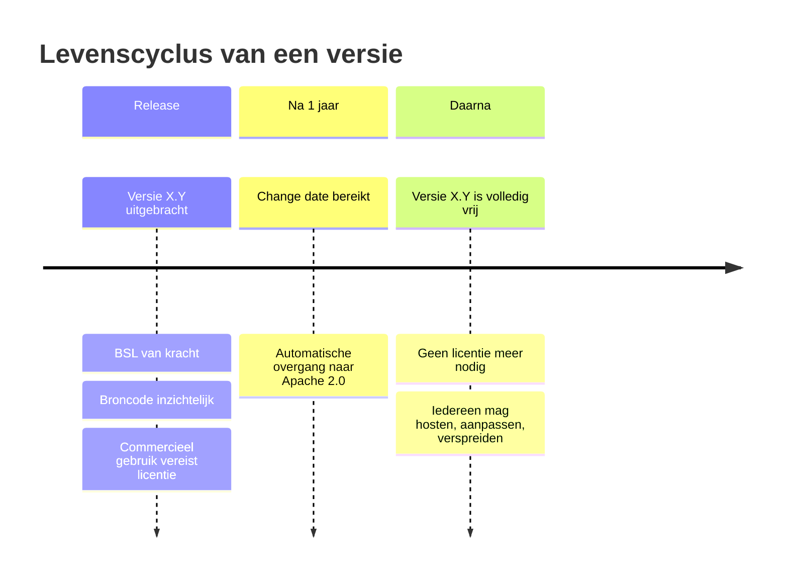

De Business Source License (BSL) is geen traditionele open source licentie — en ook geen traditionele commerciële licentie. Het is een **tijdelijk beperkende broncode-licentie** die na een vaste periode automatisch en onherroepelijk overgaat in een volledig vrije open source licentie.

---

## De drie kernelementen

### 1. Broncode is altijd inzichtelijk

Anders dan bij propriëtaire software is de broncode van BSL-software publiek beschikbaar. Je kunt lezen hoe het werkt, het inspecteren, auditen en aanpassen — ook zonder commerciële licentie.

### 2. Commercieel gebruik vereist een licentie (tijdelijk)

Elke BSL-licentie bevat een "Additional Use Grant" die precies definieert wat zonder licentie is toegestaan. Voor commercieel gebruik — zoals het aanbieden van de software als dienst aan derden — is een licentieovereenkomst nodig zolang de software jonger is dan één jaar.

### 3. Na de change date: volledige Apache 2.0

Na precies de opgegeven periode — in dit geval één jaar — gaat de licentie **automatisch en onherroepelijk** over naar Apache 2.0. Geen actie nodig, geen kosten, geen voorwaarden. De code is dan volledig vrij voor iedereen en voor elk gebruik.

---

## Wat de BSL toestaat zonder licentie

| Gebruik | Toegestaan zonder licentie? |
|---|---|
| Broncode lezen en inspecteren | Ja |
| Lokaal draaien voor ontwikkeling en testen | Ja |
| Bijdragen aan het project (patches, bugfixes) | Ja |
| Niet-commercieel gebruik (research, onderwijs) | Ja |
| Gebruik van de Apache 2.0-versie (ouder dan 1 jaar) | Ja, volledig |
| Commercieel gebruik van de nieuwste versie | Nee — licentie vereist |
| Aanbieden als dienst aan derden | Nee — licentie vereist |

### Wat "commercieel gebruik" betekent

In dit model betalen gemeenten de licentie niet rechtstreeks — de preferred supplier draagt de licentiebijdrage af aan de stichting en belast dit door aan de gemeente. Een gemeente die het platform intern gebruikt via een gecertificeerde supplier, handelt niet zelf als licentiehouder.

---

## Hoe de change date werkt

Het meest kenmerkende element van de BSL is de **change date**: een vaste termijn waarna de licentie automatisch overgaat in Apache 2.0.

**Kenmerken van de change date in dit model:**

- **Automatisch**: geen tussenkomst nodig van de stichting of leverancier
- **Onherroepelijk**: eenmaal vrijgegeven code kan niet worden teruggetrokken
- **Per versie**: elke release heeft zijn eigen change date, één jaar na die release
- **Transparant**: de change date staat in het licentiedocument van elke versie
- **Statutair geborgd**: aanpassing van de change date vereist instemmingsrecht van de stewards

Concreet: de code van versie X.Y is altijd vrij te gebruiken zodra die versie meer dan één jaar oud is — ongeacht wie de stichting bestuurt, of de stichting nog bestaat, of er een conflict is.

---

## BSL versus andere licenties

| | BSL | AGPL | SSPL | Propriëtair | Dual licensing |
|---|---|---|---|---|---|
| **Broncode inzichtelijk** | Ja | Ja | Ja | Nee | Ja (community) |
| **Vrij voor intern gebruik** | Beperkt | Ja (copyleft) | Beperkt | Nee | Beperkt |
| **Vrij voor commercieel gebruik** | Niet in jaar 1 | Ja (copyleft) | Beperkt | Nee | Nee |
| **Wordt volledig vrij** | Ja (na 1 jaar) | Al vrij | Nee | Nee | Nee |
| **Copyleft** | Nee | Sterk | Sterk | Nee | Nee |
| **Maximale lock-in** | 1 jaar | Geen | Permanent | Permanent | Permanent |

### AGPL

De Affero GPL is een sterk copyleft-licentie: wie de software als dienst (SaaS) aanbiedt, moet de volledige broncode vrijgeven — inclusief aanpassingen. Dat weerhoudt sommige commerciële partijen van gebruik. Er is geen tijdscomponent: AGPL-code wordt niet automatisch vrijer.

### SSPL (Server Side Public License)

MongoDB en Elastic kozen de SSPL als reactie op cloud providers die hun software als managed service aanboden zonder bij te dragen. De SSPL is zo restrictief dat het Open Source Initiative het niet erkent als open source. Er is geen automatische overgang naar een vrije licentie — SSPL-code blijft permanent beperkt.

### Dual licensing

Een gratis communityeditie naast een betaalde enterprise-editie. Dit model creëert twee permanente versies. De enterprise-editie blijft altijd betaald. Er is geen moment waarop de software volledig vrij wordt.

### Propriëtair

Geen broncode, geen vrijgave, permanente afhankelijkheid van één leverancier.

---

## Bekende BSL-gebruikers

De BSL is in 2016 ontworpen door MariaDB en sindsdien gebruikt door diverse projecten:

- **HashiCorp** — Terraform, Vault, Consul (overstap van MPL naar BSL in 2023)
- **Sentry** — foutmonitoringplatform
- **MariaDB** — de uitvinder van de BSL
- **CockroachDB** — distributed database
- **Couchbase** — NoSQL database

De HashiCorp-overstap leidde tot het forken van Terraform als **OpenTofu** (nu onder de Linux Foundation) — op basis van de laatste Apache 2.0-versie vóór de BSL-switch. Dit laat zien dat de community-fork optie altijd bestaat: de vrijgegeven versies zijn en blijven beschikbaar.

---

## Wat gebeurt er als de stichting ophoudt te bestaan?

Dit is een cruciale vraag voor software waarvan gemeenten jarenlang afhankelijk zijn.

Bij de BSL in dit model gelden twee lagen van bescherming:

**Laag 1 — De change date werkt automatisch:**
Elke versie gaat na één jaar sowieso over naar Apache 2.0, ongeacht wat de stichting doet. De nieuwste versie kan tijdelijk beperkt zijn; alle andere versies zijn al volledig vrij.

**Laag 2 — Statutaire borging bij ontbinding:**
Als de stichting wordt ontbonden, gaat alle nog-BSL code onmiddellijk over naar Apache 2.0. Dit is statutair vastgelegd — niet afhankelijk van de goodwill van het bestuur op dat moment.

Er is daarmee **geen scenario** waarin gemeenten achterblijven zonder toegang tot de code.

---

## Zie ook

- [Licenties](/het-verdienmodel/licenties) — Prijzen en wat licentie-inkomsten financieren
- [Steward Ownership](/verantwoord-beheer/steward-ownership) — Hoe eigenaarschap prijsmisbruik structureel voorkomt
- [Bronnen](/referentie/bronnen) — Externe links over BSL en open source licenties
