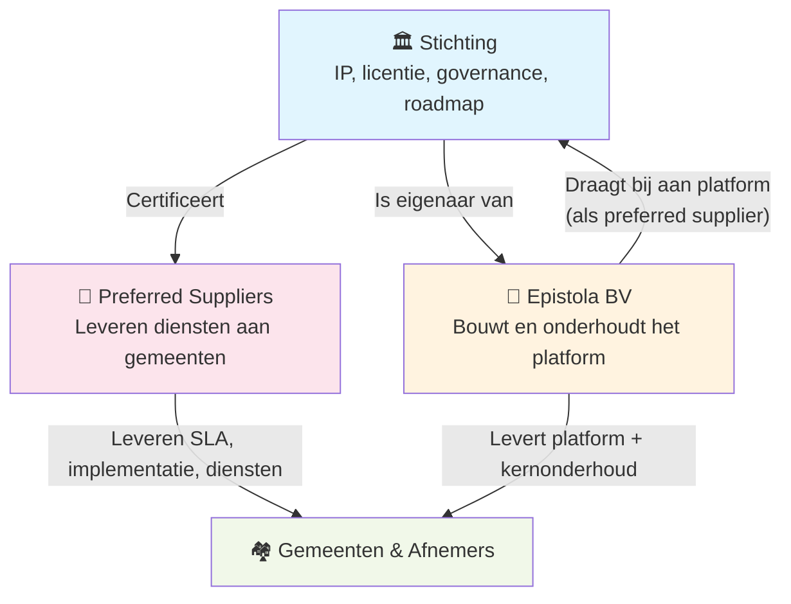

De vorige pagina's beschreven steward ownership als generiek model. Deze pagina gaat over hoe Epistola dat model concreet invult.

Het kort: er zijn twee entiteiten. De **stichting** beheert het intellectueel eigendom en bewaakt de missie. De **BV** bouwt en onderhoudt het platform als operationele uitvoerder. De stichting is eigenaar van de BV — niet andersom, en niet een externe investeerder.

---

## De structuur



De stichting **controleert** de BV via eigenaarschap. Dat betekent: de BV kan niet worden verkocht, overgenomen of van koers veranderd zonder instemming van de stichting. De stichting stelt de kaders waarbinnen de BV opereert — via statuten, aandeelhoudersovereenkomst en bestuurlijke afspraken.

De BV is zelf ook een preferred supplier: ze bouwt de kern van het platform en draagt code upstream bij. Andere preferred suppliers kunnen naast de BV opereren en concurreren op dienstverlening.

---

## De afspraken

De kaders die de stichting stelt aan de BV zijn niet vrijblijvend. Ze zijn juridisch vastgelegd en vormen de kern van het vertrouwen dat het model vraagt.

### Maximum salaris

De BV hanteert een intern salarisplafond. Niemand — inclusief de oprichters — verdient meer dan dit maximum. Het plafond is gekoppeld aan een marktconforme maatstaf en wordt periodiek geëvalueerd door de stichting.

**Waarom:** Het voorkomt dat de BV een vehikel wordt voor persoonlijke verrijking. Mensen die hier werken, doen dat omdat ze in de missie geloven — niet omdat ze hier sneller rijk worden dan ergens anders.

**Effect op kostenpredictie:** Het maximum salaris maakt de maximale loonkosten van de organisatie berekenbaar. Dat is bewust: zie het kostenmodel hieronder.

### Geen winstuitkeringen

De BV keert geen winst uit aan aandeelhouders. De stichting is de aandeelhouder — en de stichting keert ook geen winst uit. Overwinst blijft in de organisatie of wordt teruggesluisd via de mechanismen hieronder.

**Waarom:** Winstmaximalisatie als drijfveer strijdt fundamenteel met de missie. Zodra er druk is om winstmarge te verhogen — door investeerders, door een exit-scenario, door groeiambities — begint de missie te eroderen. Door winstuitkering structureel uit te sluiten, bestaat die druk niet.

### Overwinst gaat terug

Als de BV structureel meer inkomsten heeft dan nodig voor haar operatie en reserves, gaat de overwinst niet naar aandeelhouders maar terug naar de gemeenschap:

- **Terug naar klanten** — via lagere licentietarieven of een éénmalige korting voor bestaande afnemers
- **Naar de stichting** — voor het ondersteunen van vergelijkbare steward-owned projecten in de publieke sector

Dit geeft het model een "pay it forward"-karakter: succes van het platform leidt niet tot verrijking van de BV, maar tot meer ruimte voor vergelijkbare initiatieven.

### 100% focus op Epistola

De BV mag uitsluitend Epistola bouwen. Geen aanverwante producten, geen winstgevende nevenaventures, geen "terwijl we toch bezig zijn"-diversificatie.

**Waarom:** Focus is een garantie, niet alleen een strategie. Als de BV mag uitbreiden naar andere producten of markten, ontstaat er een prikkel om capaciteit van Epistola weg te halen naar kansen met een hogere marge. 100% focus maakt die prikkel structureel onmogelijk.

### Maximum omvang: 20 FTE (Nederland)

Zolang de BV alleen in Nederland opereert, groeit ze niet boven 20 voltijdse medewerkers. Dit is een expliciete keuze, geen tijdelijke beperking.

**Waarom:** Zie het kostenmodel hieronder. Maar ook: een kleine, geconcentreerde organisatie is wendbaarder, heeft minder coördinatiekosten en blijft dichter bij de kern van het platform.

Als vraag en capaciteit groeien voorbij wat 20 FTE aankan, wordt extra capaciteit geborgd via preferred suppliers — niet via interne groei van de BV. Dat is bewust: het ecosysteem van suppliers is de schaalstrategie, niet de BV zelf.

Internationale expansie valt buiten de huidige afspraken en vereist nieuwe kaders.

---

## Het kostenmodel: transparant en begrensd

De combinatie van maximum salaris en maximum omvang maakt de maximale operationele kosten van de BV berekend en publiek:

```
Maximale jaarkosten BV ≈ 20 FTE × maximum salaris × (1 + overhead factor)
```

De stichting weet dus wat het kost om de BV te laten functioneren. Dat maakt het bepalen van licentietarieven minder gokken en meer ingenieursvraagstuk: hoeveel gemeenten moeten hoeveel betalen om de stichting en de BV duurzaam te financieren?

Het geeft ook gemeenten en leveranciers een eerlijk beeld: de licentiekosten financieren een organisatie met een expliciet begrensd kostenplafond. Geen onzichtbare winstmarge, geen onbeperkte salarisgroei.

---

## Waarom deze combinatie werkt

Elk van de afspraken is zinvol op zichzelf. Samen vormen ze een systeem van wederzijdse versterkende prikkels:

| Afspraak | Voorkomt | Bevordert |
|---|---|---|
| Maximum salaris | Persoonlijke verrijking als drijfveer | Mission-gedreven medewerkers |
| Geen winstuitkering | Exit-druk, investeerdersbelang | Lange-termijn focus |
| Overwinst terug naar gemeenschap | Accumulatie in de BV | Vertrouwen bij afnemers |
| 100% focus | Capaciteitsafleiding, missie-erosie | Kwaliteit van het kernproduct |
| Max 20 FTE | Ongecontroleerde kostengroei | Voorspelbaarheid voor alle partijen |

Het model is niet perfect: groei is begrensd, salarisniveaus zijn begrensd, en niet iedereen zal bereid zijn om op die basis te werken. Maar dat is de bewuste keuze: een stabiele, missie-gestuurde organisatie die jarenlang kan functioneren, is meer waard dan een snelgroeiende organisatie die de missie onderweg verliest.

---

## Licenties of diensten: de afweging voor Epistola

Epistola's voorkeur is volledig open source te zijn en te verdienen op diensten — zonder licentiemodel. Dat is een bewuste keuze, maar het is eerlijk om de vergelijking te maken.

### De voorkeur: open source + diensten

- Geen adoptiedrempel: iedereen kan starten zonder contractuele verplichting
- Vertrouwen bij overheden: de publieke sector is sceptisch over "open source met addertjes"
- Bijdragen van buiten worden niet geremd door licentievragen
- De echte waarde zit in expertise — template kwaliteitscheck, versie-compatibiliteitsvalidatie, implementatiebegeleiding — niet in de code zelf

De structuur van de BV versterkt dit model: een small team met 100% focus, lage overhead, geen winstdoelstelling. Dat maakt diensten concurrerend prijzen zonder de marges van een commercieel bureau te hoeven doorberekenen.

### Het structurele risico van diensten als enige financiering

Een concurrent die géén platform-onderhoud draagt, kan dezelfde diensten goedkoper aanbieden. Als de BV alle onderhoudslasten draagt en anderen gratis meeliftend diensten aanbieden, verslechtert de concurrentiepositie naarmate het platform succesvoller wordt.

Zie ook de [structurele zwakte van het dienstenmodel](/introductie/de-oplossingen#een-variant-van-product-naar-diensten) in De Oplossingen.

### Als Epistola toch voor licenties zou kiezen

| Aspect | Open source + diensten | Met licentiemodel |
|---|---|---|
| **Adoptiedrempel** | Geen | Uitlegbehoefte bij overheden |
| **Inkomstenstabiliteit** | Afhankelijk van dienstenvraag | Voorspelbare licentiebasis |
| **Concurrentierisico diensten** | Hoog (anderen liften mee) | Lager (licentie financiert onderhoud apart) |
| **Vertrouwen bij gemeenten** | Hoog ("echt open source") | Vraagt uitleg |
| **Financiering bij lage dienstenvraag** | Kwetsbaar | Geborgd via licenties |

Het licentiemodel is de **vangvloer**, niet de eerste keus. Als diensteninkomsten onvoldoende zijn om de BV en stichting te financieren — omdat concurrenten structureel meeliftend diensten aanbieden — dan is het licentiemodel de structurele zekerheid die dat corrigeert.

In dat scenario is de BSL geen ideologische keuze maar een pragmatische: de stichting kan altijd besluiten tot een licentiemodel als het open source + diensten model structureel faalt.

---

## Zie ook

- [Steward Ownership](/verantwoord-beheer/steward-ownership) — Het bredere model waarvan dit de concrete toepassing is
- [Organisatievormen Vergeleken](/verantwoord-beheer/organisatievormen) — Waarom commerciële en traditioneel niet-commerciële vormen elk tekortschieten
- [Structuur & Rollen](/verantwoord-beheer/structuur) — Hoe stichting, BV, suppliers en gemeenten samenwerken
- [Licenties](/het-verdienmodel/licenties) — Hoe licentie-inkomsten de stichting en BV financieren
- [De impact van AI](/referentie/ai-impact) — Hoe AI de concurrentiedynamiek verandert voor open source platforms
