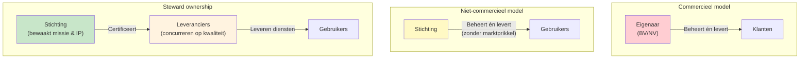

Als je weet hoe je een open source platform wilt financieren, blijft er een tweede vraag: **wie beheert de inkomsten, wie bewaakt de missie, en hoe voorkom je dat geld macht koopt?**

De keuze van organisatievorm bepaalt het antwoord op alle drie.

---

## De commerciële organisatie

Een BV of NV met één eigenaar of investeerders. De eigenaar ontwikkelt het platform, verkoopt het als dienst, en verdient aan gebruik en licenties.

**Wat werkt:**
- Sterke prikkel om te investeren in kwaliteit — slechte software verliest klanten
- Snelle besluitvorming
- Heldere verantwoordelijkheid

**Wat niet werkt:**

*Lock-in is structureel.* De eigenaar heeft er commercieel belang bij dat klanten afhankelijk blijven. Data-export is moeilijk, overstappen is duur, concurrentie wordt ontmoedigd. Dit is geen kwade wil — het is een rationele reactie op de prikkel die eigendom creëert.

*Exitdruk corrumpeert missie.* Wie met investeerders werkt, moet ooit een exit realiseren. Dat betekent: de organisatie wordt verkocht aan een partij wiens belangen niet altijd samenvallen met die van de gebruikers. De missie die aan het begin werd beloofd, sneuvelt op het moment dat de koopsom hoog genoeg is.

*Continuïteit is afhankelijk van één partij.* Als het bedrijf failliet gaat, stopt het platform. Klanten zitten met een probleem.

---

## De traditioneel niet-commerciële organisatie

Een stichting of vereniging zonder winstoogmerk. De missie is statutair verankerd. Er is geen aandeelhouder die exit wil.

**Wat werkt:**
- Missie is beschermd — geen commerciële druk om af te wijken
- Geen lock-in via eigenaarschap
- Vertrouwen bij publieke organisaties

**Wat niet werkt:**

*Geen commerciële prikkel voor kwaliteit.* Als er geen concurrentie is en geen markt, is er geen mechanisme dat slechte kwaliteit bestraft of goede kwaliteit beloont. Niet-commerciële organisaties kunnen stagneren zonder dat iemand het voelt.

*Financieel fragiel.* Stichtingen zijn afhankelijk van subsidies, donaties of contributies. Die zijn onzeker, onregelmatig en politiek gevoelig. Het maakt langetermijnplanning moeilijk.

*Uitvoering zonder expertise.* Een stichting die zelf software bouwt en onderhoudt, moet technische expertise intern opbouwen — zonder de salarisverhoudingen die de markt biedt. Dat lukt zelden structureel.

---

## Steward ownership

Steward ownership combineert wat bij de andere twee vormen niet samengaat: **niet-commercieel eigendom van de kern, gecombineerd met commerciële uitvoering door meerdere concurrerende leveranciers.**

De stichting bezit het platform. Ze kan het niet verkopen, niet privatiseren, en keert geen winst uit. De missie is statutair geborgd — net als bij een traditionele stichting.

Maar de stichting levert zelf niets. Alle dienstverlening — hosting, support, implementatie, doorontwikkeling — wordt gedaan door gecertificeerde commerciële leveranciers die onderling concurreren. Die concurrentie is de kwaliteitsprikkel die bij de traditionele stichting ontbreekt.

---

## De vergelijking

| | Commercieel | Niet-commercieel | Steward owned |
|---|---|---|---|
| **Missie beschermd** | Risico bij exit of druk | Ja | Ja, statutair |
| **Vendor lock-in** | Structureel risico | Laag | Structureel voorkomen |
| **Kwaliteitsprikkel** | Sterk (markt) | Zwak | Sterk (concurrentie tussen leveranciers) |
| **Continuïteit** | Afhankelijk van eigenaar | Afhankelijk van financiering | Structureel geborgd |
| **Financiële duurzaamheid** | Winstgedreven | Afhankelijk van subsidies | Licenties + diensten |
| **Meerdere leveranciers mogelijk** | Nee (eigenaar controleert) | Soms | Ja, expliciet ontworpen |

---

## Wat maakt steward ownership anders?

Het sleutelprincipe is de **scheiding van eigendom en uitvoering**:

- De stichting is eigenaar van de software, de licentie en de roadmapprincipes — maar levert zelf niets
- Commerciële leveranciers leveren alles — maar bezitten niets

Dat betekent: de commerciële prikkel voor kwaliteit bestaat (leveranciers concurreren), maar de commerciële prikkel voor lock-in bestaat niet (de stichting is niet te koop, en de code gaat na een jaar sowieso open source).

Het model is niet perfect. Governance kost tijd. Certificering kost geld. Coördinatie tussen leveranciers vraagt aandacht. Maar het lost de fundamentele spanning op die bij de andere twee vormen structureel aanwezig is.

[→ Hoe steward ownership in de praktijk werkt](/verantwoord-beheer/steward-ownership)
