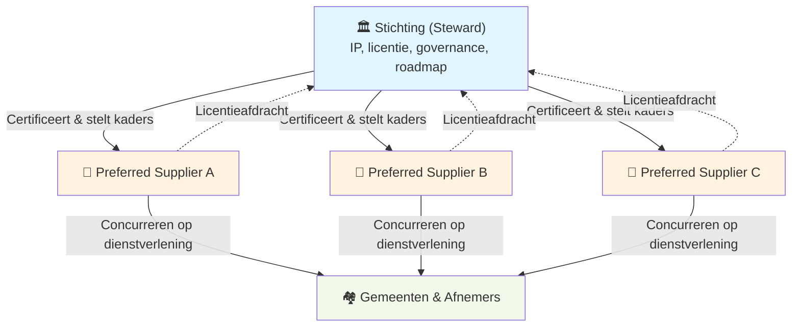

Een open platform voor de publieke sector heeft niet alleen een goed verdienmodel nodig — het moet ook **betrouwbaar** zijn. Wie zorgt ervoor dat het platform niet in verkeerde handen valt? Wie beschermt de missie als er druk komt van commerciële partijen? Wie garandeert dat de open source belofte ook echt wordt nagekomen?

Het antwoord is **steward ownership**: een eigendoms- en governancemodel waarbij zeggenschap niet wordt gedreven door kapitaal, maar door het doel waarvoor de organisatie bestaat.

---

## Wat is steward ownership?

Bij steward ownership is het platform geen bezit dat kan worden verkocht of geprivatiseerd. De kern — broncode, architectuur, merk, roadmapprincipes — is ondergebracht in een onafhankelijke stichting die fungeert als steward. De stichting heeft geen aandeelhouders en keert geen winst uit.

Steward ownership beantwoordt de vraag: **wie zorgt ervoor dat het platform blijft wat het moet zijn?**

Zonder steward ownership zijn er twee risico's:
- **Overname:** Een commerciële partij koopt het platform en introduceert alsnog lock-in
- **Afdwaling:** Bestuurders met goede bedoelingen laten de missie geleidelijk eroderen onder commerciële druk

Steward ownership voorkomt beide door eigendom en zeggenschap structureel te scheiden van financieel belang.

---

## Steward ownership in dit model

In klassieke steward ownership beheert een stichting de missie van één specifiek bedrijf. In dit model is dat anders: de stichting is de **actieve steward van een gedeelde publieke kern**, terwijl meerdere commerciële partijen concurreren op dienstverlening rond die kern.

Dit noemen we **ecosysteemgericht steward ownership**:

De structurele kenmerken:
- **Doel boven kapitaal:** De stichting kan niet worden verkocht of overgenomen
- **Scheiding van zeggenschap en financieel belang:** Bestuurders en stewards profiteren niet van de waardeontwikkeling van het platform
- **Onvervreemdbaar kernvermogen:** Software, licentie en roadmap kunnen niet worden geprivatiseerd
- **Geen single point of failure:** Meerdere leveranciers leveren diensten; geen enkele heeft exclusieve controle

---

## Waarom vertrouwen op steward ownership?

Het verschil met "we beloven het" is juridisch en structureel:

| Garantie | Hoe geborgd? |
|---|---|
| Licentie gaat na 1 jaar naar Apache 2.0 | Statutair vastgelegd, zware besluit om te wijzigen |
| Platform kan niet worden overgenomen | Stichting heeft geen aandeelhouders, statuten verbieden dit |
| Winst kan niet worden uitgekeerd | Statutair verbod op winstuitkering |
| Stewards hebben geen eigenbelang | Onafhankelijkheidseis in samenstelling |
| Missie-wijziging vereist supermeerderheid | Zwaar besluit: 2/3 bestuur + 2/3 stewards |
| IP blijft publiek bij opheffing | Statutair: bij ontbinding gaat IP naar publiek domein |

---

## Stewards: de wakers van de missie

Stewards zijn onafhankelijke personen die toezien op de missie en de governance. Ze hebben **geen financieel belang** in commerciële leveranciers en kunnen niet profiteren van de waardeontwikkeling van het platform.

**Samenstelling (5–9 personen):**
- Minimaal 2 onafhankelijke experts (juridisch, technisch, public governance)
- 1–3 gebruikersvertegenwoordigers (gemeenten)
- 1–3 technische stewards (architectuur, security)
- Maximaal 1 vertegenwoordiger van een preferred supplier

**Instemmingsrecht bij zware besluiten:**
- Missiewijziging
- Licentiewijziging of aanpassing van de change date
- IP-overdracht
- Fundamentele governance-wijzigingen
- Statutenwijziging
- Ontbinding

Stewards kunnen reguliere besluiten niet blokkeren — hun instemmingsrecht geldt alleen voor beslissingen die de publieke kern raken.

[→ Gedetailleerde stewards-informatie](/verantwoord-beheer/governance/stewards)

---

## Structuur en scheiding van rollen

De scheiding van rollen is het fundament van betrouwbaar beheer:

| Rol | Doet wel | Doet niet |
|---|---|---|
| **Stichting** | IP beheren, certificeren, governance, roadmapregie | Diensten leveren, aanbestedingen, factureren |
| **Preferred suppliers** | Diensten leveren, ontwikkelen, SLA, hosting | Eigendom claimen, forks maken, governance beïnvloeden |
| **Gemeenten** | Diensten afnemen, leverancier kiezen | Rechtstreeks contract met stichting |

Deze scheiding is vastgelegd in de statuten en gehandhaafd door de stichting.

[→ Meer over structuur en rollen](/verantwoord-beheer/structuur)

---

## Zie ook

- [Structuur & Rollen](/verantwoord-beheer/structuur) — Hoe de drie lagen zijn georganiseerd
- [Governance](/verantwoord-beheer/governance/governance) — Hoe besluiten worden genomen
- [Stewards](/verantwoord-beheer/governance/stewards) — Wie de stewards zijn en wat ze doen
- [Statuten](/verantwoord-beheer/governance/statuten) — De juridische basis
- [Licenties](/het-verdienmodel/licenties) — Hoe het licentiemodel werkt
