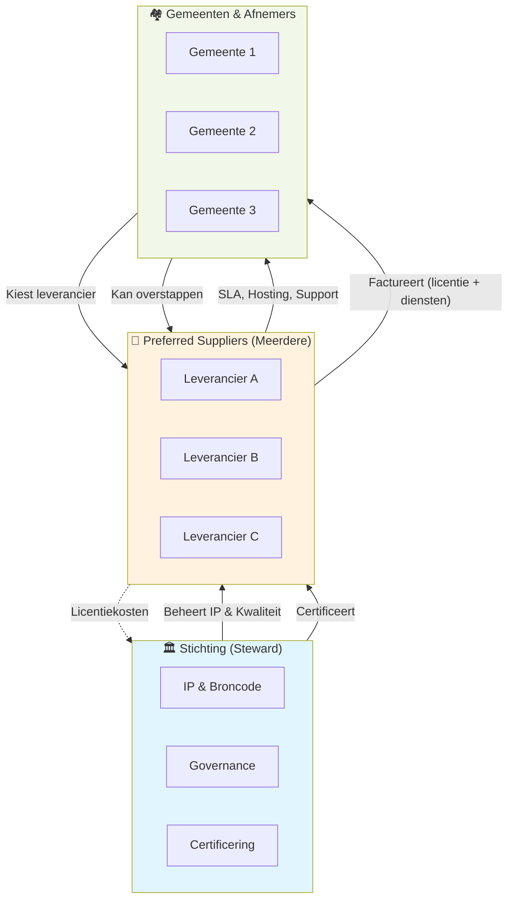

Het platform is georganiseerd in drie lagen die elk een duidelijke rol hebben. De scheiding tussen die lagen is het fundament van zowel het verdienmodel als het betrouwbare beheer.

---

## De drie lagen

### Stichting (steward)

De stichting is de bewaker van het platform als publieke voorziening. Ze levert **zelf geen diensten** aan gemeenten en factureert niet rechtstreeks.

**Taken:**
- Beheer van intellectueel eigendom (broncode, merk, architectuur)
- Bewaken van missie, waarden en continuïteit
- Vaststellen van governance, licentie en architectuurprincipes
- Certificering en toezicht op preferred suppliers
- Regie op publieke roadmapprioriteiten
- Handhaving van naleving (upstream-bijdragen, licentie, compliance)

**Niet-taken:**
- Geen development, operatie of SLA
- Geen support, hosting, training of implementaties
- Geen aanbestedingsdeelname of klantcontracten

De stichting kan externen inhuren voor governance en audit (architect, securityconsultant), maar die werkzaamheden zijn ondersteunend aan stewardship, niet directe dienstverlening aan gemeenten.

---

### Preferred Suppliers

Alle dienstverlening wordt geleverd door **preferred suppliers**: gecertificeerde commerciële partijen die aantoonbaar voldoen aan kwaliteits- en securityeisen.

**Taken:**
- Ontwikkeling en doorontwikkeling
- Onderhoud en lifecycle management (SLA / LCM)
- Support en incidentafhandeling
- Implementaties en migraties
- Training en advies

**Verdienpositie:**
Suppliers verdienen aan dienstverlening, niet aan eigendom van de software. De licentie mogen ze met beperkte marge doorbelasten (max 10–15%); hun werkelijke verdiensten liggen bij SLA, hosting, maatwerk en diensten.

---

### Gemeenten & Afnemers

Gemeenten contracteren uitsluitend met preferred suppliers — nooit rechtstreeks met de stichting.

**Kenmerken:**
- Vrije keuze uit meerdere gecertificeerde leveranciers
- Kunnen altijd overstappen (data portability is verplicht)
- Behouden eigendom van hun data
- Toegang tot het platform blijft gewaarborgd ook als hun leverancier stopt

---

## Contractuele relaties

| Relatie | Inhoud |
|---|---|
| Afnemer ↔ Preferred Supplier | Dienstverlening, SLA/LCM, facturatie |
| Stichting ↔ Preferred Suppliers | Governance, kaders, kwaliteits- en toelatingsafspraken |
| Stichting ↔ Afnemers | Geen directe dienstverlening of facturatie |

---

## Preferred supplier: certificering

Preferred supplier is een kwalificatie die een commerciële partij kan verkrijgen na certificering door de stichting. Het geeft geen exclusieve rechten en geen zeggenschap over governance of IP.

### Waarom preferred supplier?

Het werken met preferred suppliers dient om:
- Kwaliteit en continuïteit te borgen
- Beveiliging en compliance te waarborgen
- Afnemers duidelijkheid te geven over gekwalificeerde partijen

### Concrete certificeringscriteria

**Technische vereisten:**
- ISO/IEC 27001 of gelijkwaardig ISMS
- Security patches: kritiek < 48 uur, normaal < 2 weken
- Software Bill of Materials (SBoM) bij elke deployment
- Dependency scanning en vulnerability tracking (geautomatiseerd)
- Jaarlijkse penetration testing (onafhankelijk)

**Proces- en governance-vereisten:**
- Responsible disclosure beleid (publiek beschikbaar)
- Upstream bijdragen: minimaal 20% dev-uren naar het platform per jaar, of min. €10.000/jaar in gefinancierde features/fixes
- Naleving van de BSL + change date — geen exploitatie
- Transparante SLA-communicatie naar klanten
- No-lock-in praktijken (data portability, API-documentatie)

**Operationele vereisten:**
- Minimaal 99% uptime garantie (testbaar dashboard)
- Incident response < 4 uur bij kritieke incidenten
- Data retention/deletion beleid publiek
- Reguliere externe security audits

### Certificeringsproces

1. Aanmelding: formulier + checklist + referenties
2. Administratieve controle (±2 weken)
3. Documenttoetsing: certificaten, policies, SLA's (±3 weken)
4. Referentiecheck: contact met 2+ bestaande klanten (±2 weken)
5. Technische audit: optioneel, op basis van risico (±1–2 weken)
6. Besluit: go/no-go met motivering
7. Beroep: afgewezen partij kan beroep aantekenen

**Geldigheid:** 2 jaar; jaarlijkse hercertificering (lichtere controle)
**Kosten:** €2.000–€5.000 initieel; €1.000/jaar hercertificering

### Rechten van preferred suppliers

- Gebruik van "Preferred Supplier" in marketing (via templates)
- Deelname aan stichting-georganiseerde training en webinars
- Prioriteit in gezamenlijke communicatie naar potentiële klanten
- Minimaal 3 maanden voormeldingperiode bij intrekking certificering

### Gronden voor intrekking

- Structurele schending licentievoorwaarden
- Verlies van security-certificering
- Kritieke incident niet afgehandeld binnen SLA (2x per jaar)
- Persistent upstream non-compliance (< 10% bijdrage)
- Handelen in strijd met de publieke missie

**Procedure:** Schriftelijke waarschuwing → mediation → formeel intrekkingsbesluit (bestuur + steward-instemming) → publicatie motivering → mogelijkheid re-certificering na 12 maanden.

---

## Gelijk speelveld

Er is geen structurele exclusiviteit en geen permanente voortrekkersrol voor oprichters. Tijdelijke oprichtersvoordelen zijn toegestaan mits de scope en duur vooraf expliciet zijn vastgelegd en het gelijke speelveld na afloop volledig herstelt.

Alle commerciële partijen opereren binnen dezelfde governance-, licentie- en kwaliteitskaders. Concurrentie vindt plaats op kwaliteit en prijs van dienstverlening.

---

## Doorontwikkeling & features

**Publieke roadmap (collectief gefinancierd):**
- Als 3+ gemeenten dezelfde feature willen → opname in publieke roadmap
- Stichting financiert (uit licentie-inkomsten); preferred supplier voert uit
- Iedereen profiteert (upstream)

**Private/custom development (gemeente-betaald):**
- Gemeente betaalt preferred supplier direct voor specifieke wens
- Code gaat upstream (geen private forks, geen exclusiviteit)
- Andere gemeenten kunnen later profiteren

**Eigen investeringen supplier:**
- Suppliers mogen zelfstandig investeren in doorontwikkeling
- Geen eigendomsrechten of exclusieve features als resultaat
- Altijd upstream-verplichting

---

## Continuïteit bij leveranciersuitval

Als een preferred supplier stopt, failliet gaat of zijn diensten staakt:
- Blijft het platform bestaan onder beheer van de stichting
- Blijven broncode, documentatie en IP beschikbaar
- Blijven afnemers eigenaar van hun data
- Kan een andere preferred supplier de dienstverlening overnemen

De stichting borgt dit via onafhankelijk IP-beheer, open documentatie, stimulering van meerdere leveranciers en overdraagbaarheidsclausules in contractkaders.

---

## Conflict of interest

- De stichting levert zelf geen commerciële diensten
- Bestuurders en stewards hebben geen doorslaggevend financieel belang bij preferred suppliers
- Preferred suppliers hebben geen beslissende zeggenschap over missie, licentie of governance
- Rollen van steward, bestuurder en dienstverlener zijn expliciet gescheiden
- Bij (potentiële) belangenverstrengeling: meldplicht + onthouding van stemming

---

## Zie ook

- [Steward Ownership](/verantwoord-beheer/steward-ownership) — Het eigendomsmodel
- [Governance](/verantwoord-beheer/governance/governance) — Hoe besluiten worden genomen
- [Licenties](/het-verdienmodel/licenties) — Licentieopbouw en margebeleid
- [SLA & Support](/het-verdienmodel/sla-en-support) — Dienstverleningsniveaus
